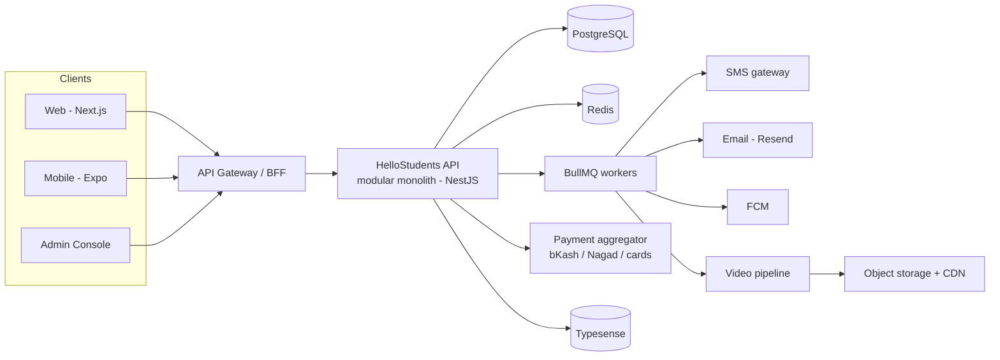

# HelloStudents

**An open tutor marketplace for Bangladesh.** Any individual tutor or coaching-centre teacher self-onboards, publishes their own classes, sets their own price and schedule, and gets paid directly. Students discover them by subject, grade, board, area and price, book with prepaid credits, attend live or watch the recording, and rate the tutor afterwards.

The existing BD ed-tech incumbents (10 Minute School, Bohubrihi, Shikho) are **centrally produced content** businesses — a curriculum team decides what gets made, and supply is capped by that team's throughput. HelloStudents is a **supply-side marketplace**: the platform never produces content, it produces liquidity. The unit of value is a named local teacher who can already fill a room in Dhanmondi, not a studio-recorded lecture.

---

## Documentation map

Read in this order if you are new to the project.

| # | Document | What it answers |
|---|---|---|
| 01 | [Product Overview](docs/01-product-overview.md) | Why this exists, who it serves, what is explicitly out of scope, how success is measured |
| 02 | [Domain Model & Glossary](docs/02-domain-model.md) | The Bangladeshi education taxonomy, geography, and every term used in the rest of the docs |
| 03 | [System Architecture](docs/03-architecture.md) | Stack, module boundaries, deployment topology, observability |
| 04 | [Data Model](docs/04-data-model.md) | Every table, constraint and invariant, with DDL |
| 05 | [API Reference](docs/05-api-reference.md) | Endpoint catalogue, auth, pagination, errors, idempotency |
| 06 | [Tutor Onboarding & Verification](docs/06-tutor-onboarding.md) | Feature 1 — profile, credentials, verification tiers, pricing |
| 07 | [Classes, Scheduling & Booking](docs/07-classes-scheduling.md) | Features 2 & 4 — offerings, sessions, availability, conflict detection |
| 08 | [Discovery & Search](docs/08-discovery-search.md) | Feature 3 — browse, filter, rank, Bangla text handling |
| 09 | [Payments, Credits & Payouts](docs/09-payments-credits.md) | Feature 5 — bKash/Nagad, the credit ledger, tutor settlement |
| 10 | [Recordings & Media](docs/10-media-recordings.md) | Feature 6 — ingest, transcode, entitlement, playback |
| 11 | [Ratings, Reviews & Trust](docs/11-ratings-reviews.md) | Feature 7 — review integrity, abuse, disintermediation defence |
| 12 | [Admin Console](docs/12-admin-console.md) | Feature 8 — approval queues, disputes, revenue dashboard |
| 13 | [Notifications](docs/13-notifications.md) | Feature 9 — SMS-first delivery, templates, quiet hours |
| 14 | [Security, Privacy & Compliance](docs/14-security-compliance.md) | RBAC, PII handling, BD regulatory posture, fraud |
| 15 | [Delivery Plan & Roadmap](docs/15-roadmap-delivery.md) | Phasing, milestones, team shape, launch criteria |

### Diagrams

| # | Document | What it shows |
|---|---|---|
| 16 | [Wireframes](docs/16-wireframes.md) | Layout and control placement for all 15 critical-path screens, student / tutor / admin |
| 17 | [Schema Diagram](docs/17-schema-diagram.md) | ER diagrams per module, the money and calendar spines, and every database-enforced invariant |

### Architecture Decision Records

Decisions that are expensive to reverse, with the reasoning preserved.

| ADR | Decision |
|---|---|
| [001](docs/adr/ADR-001-credit-unit.md) | Credits are money-pegged; "hours" are a tutor-scoped product on top |
| [002](docs/adr/ADR-002-modular-monolith.md) | Modular monolith, not microservices |
| [003](docs/adr/ADR-003-live-class-delivery.md) | Bring-your-own Zoom/Meet link before a native classroom |
| [004](docs/adr/ADR-004-booking-concurrency.md) | Booking conflicts enforced by a Postgres exclusion constraint |
| [005](docs/adr/ADR-005-payments-aggregator-first.md) | Aggregator (SSLCommerz/ShurjoPay) first, direct bKash later |

---

## The shape of the system in one diagram



---

## Repository layout (target)

```
HelloStudents/
├── apps/
│   ├── api/            # NestJS modular monolith — all business logic
│   ├── web/            # Next.js — student + tutor surfaces
│   ├── admin/          # Next.js — internal console
│   └── mobile/         # Expo — student app (Phase 3)
├── packages/
│   ├── contracts/      # Shared zod schemas + generated OpenAPI types
│   ├── domain/         # Pure domain logic: pricing, conflicts, ledger rules
│   └── ui/             # Shared component library, bn/en aware
├── infra/              # Terraform, Docker, migrations, seed data
└── docs/               # You are here
```

## Conventions that apply everywhere

- **Money** is stored as an integer count of **poisha** (1 BDT = 100 poisha). Never a float. Never a decimal in JSON — always an integer plus an explicit `currency: "BDT"`.
- **Time** is stored as `timestamptz` in UTC and rendered in `Asia/Dhaka` (UTC+06:00, no DST). Every API timestamp is RFC 3339 with an explicit offset.
- **Phone numbers** are the primary user identifier and are stored E.164 (`+8801XXXXXXXXX`). See [02](docs/02-domain-model.md#24-phone-numbers).
- **Identifiers** exposed over the API are prefixed ULIDs (`tut_01HQ…`, `ses_01HQ…`) — sortable, opaque, and self-describing in logs.
- **Language**: every user-visible string ships in `bn-BD` and `en`. Bangla is the default for student surfaces.
- **All mutations** accept an `Idempotency-Key`. See [05](docs/05-api-reference.md#idempotency).

## Status

Documentation-complete, pre-implementation. Nothing in `apps/` exists yet — [15](docs/15-roadmap-delivery.md) is the build order.
