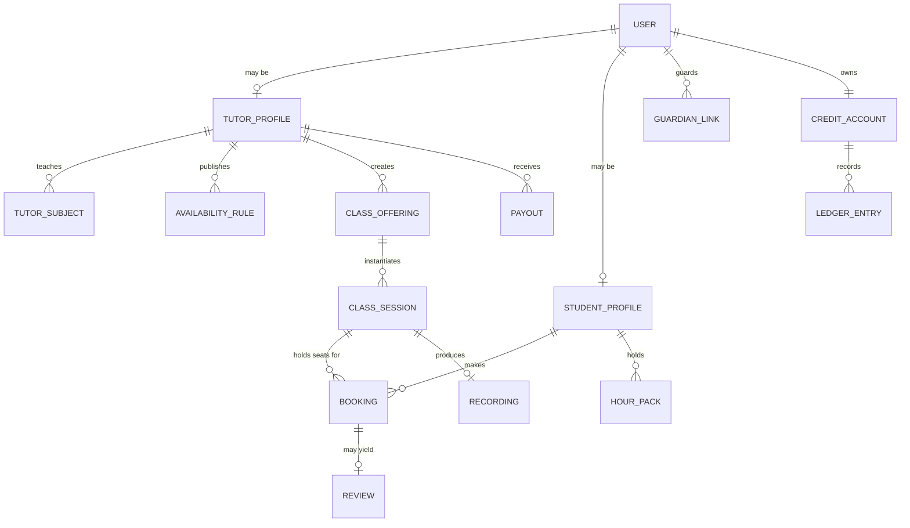

# 02 — Domain Model & Glossary

This document fixes the vocabulary. Every other document, every table name, and every API field uses these terms exactly as defined here. Most of the modelling difficulty in this product is not technical — it is that the Bangladeshi education system has several parallel curricula with different grade names, exam names and governing boards, and a generic "grade level" integer silently corrupts search relevance for a third of the market.

---

## 2.1 Core entities



| Term | Definition |
|---|---|
| **User** | One human, one phone number, one account. Roles are additive — the same User may hold `student`, `tutor` and `guardian` roles simultaneously. There is no separate "tutor login". |
| **Tutor Profile** | The seller-side extension of a User: bio, subjects, credentials, verification tier, service areas, base rate. A User without an approved Tutor Profile cannot publish offerings. |
| **Student Profile** | The buyer-side extension: current grade, curriculum, board, preferred areas and languages. |
| **Guardian Link** | A parent/payer User linked to a Student User with a declared relationship and a permission set (fund wallet, view ledger, receive notifications, approve bookings). |
| **Class Offering** | A *sellable thing a tutor publishes* — "HSC Physics 1st Paper, Chapter-wise, one-to-one, online, ৳900/hour". It is a template and a price, not a calendar entry. Has a `delivery_mode` (live / recorded) and a `format` (one-to-one / group). |
| **Class Session** | A *specific instance in time* of an offering: starts at a timestamp, has a duration, has a capacity, has a live link, may produce a recording. This is the unit that occupies a tutor's calendar and the unit that gets charged. |
| **Booking** | A student's claim on a seat in a session, with its own lifecycle and its own money. `n` bookings per session for group format; exactly 1 for one-to-one. |
| **Enrolment** | A student's claim on a *recorded* offering — no session, no calendar, grants playback entitlement for a defined window. |
| **Availability Rule** | A recurring weekly window in which a tutor accepts bookings (e.g. Sun–Thu 16:00–21:00 Asia/Dhaka), plus **Availability Exceptions** for holidays and one-off blocks. |
| **Credit** | The platform's internal unit of prepaid value. **1 credit = 1 poisha = 0.01 BDT.** Fungible across all tutors. See [ADR-001](adr/ADR-001-credit-unit.md). |
| **Hour Pack** | A prepaid bundle of *N hours with one specific tutor* at a locked hourly rate. Non-fungible. The literal "buy N hours, deduct per class" product from the brief. |
| **Ledger Entry** | An immutable, signed movement of credits against an account. The balance is the sum of entries. Nothing mutates a balance except an entry. |
| **Payout** | A settlement transfer of accrued earnings from the platform to a tutor's bKash/Nagad/bank account, net of commission. |
| **Dispute** | A student- or tutor-raised claim about a session (no-show, quality, technical failure) that suspends settlement of that session's funds until resolved. |
| **Verification Tier** | L0–L3, the trust level of a tutor. Drives badges, search ranking, and the maximum price a tutor may set. See [06](06-tutor-onboarding.md#63-verification-tiers). |

---

## 2.2 The education taxonomy

This is the part that must be right before the first line of code. Four curricula coexist in Bangladesh, and a student in one of them will not accept results from another.

### Curricula

| Code | Name | Language of instruction | Notes |
|---|---|---|---|
| `NCTB_BN` | National Curriculum, Bangla medium | Bangla | The largest segment by far. NCTB textbooks, national board exams. |
| `NCTB_EN` | National Curriculum, English version | English | Same NCTB syllabus and same board exams, taught and examined in English. **Not** the same as English medium — conflating these two is a common and expensive modelling error. |
| `CAMBRIDGE_EDEXCEL` | English medium | English | O Level / A Level / IGCSE under Cambridge or Pearson Edexcel. Urban, high-income, high price point. |
| `MADRASAH` | Madrasah stream | Bangla / Arabic | Ebtedayee → Dakhil → Alim, under the Bangladesh Madrasah Education Board. |

### Stages and grades

| Stage | Grades | Terminal exam |
|---|---|---|
| Primary | Class 1–5 | — |
| Junior secondary | Class 6–8 | — |
| Secondary | Class 9–10 | **SSC** (or **Dakhil** for madrasah, **O Level** for English medium) |
| Higher secondary | Class 11–12 | **HSC** (or **Alim**, or **A Level**) |
| Admission | post-HSC | University admission tests |

Grade levels are stored as a **code**, not an integer: `CLASS_6` … `CLASS_12`, plus `O_LEVEL`, `AS_LEVEL`, `A_LEVEL`, `DAKHIL`, `ALIM`, `ADMISSION`. An integer cannot represent "A Level Year 1", and the SSC/O Level equivalence is a *search-expansion* concern, not an identity.

### Streams (Classes 9–12, national curriculum)

`SCIENCE` · `HUMANITIES` (Arts) · `BUSINESS_STUDIES` (Commerce)

Stream drives which subjects are even offerable at Class 9+. A Physics tutor is irrelevant to a Business Studies student and must not appear in their results.

### Education boards

For national-curriculum students, the board matters because question patterns differ and tutors advertise board-specific results.

`DHAKA` · `CHATTOGRAM` · `RAJSHAHI` · `KHULNA` · `BARISHAL` · `SYLHET` · `CUMILLA` · `DINAJPUR` · `MYMENSINGH` · `MADRASAH` · `TECHNICAL`

### Subjects

Subjects are a curated, versioned reference table — **not** free text from tutors. Free-text subjects destroy search facets within a week. Each subject carries:

```
code            HSC_PHYSICS_1
name_en         Physics 1st Paper
name_bn         পদার্থবিজ্ঞান ১ম পত্র
curriculum      NCTB_BN, NCTB_EN
grade_levels    CLASS_11, CLASS_12
stream          SCIENCE
aliases         ["physics 1st", "পদার্থ ১ম", "phy 1st paper"]
```

`aliases` exist because students search "phy 1st paper" and "পদার্থ" in roughly equal measure, often in the same session. Tutors may *request* a new subject; an admin approves it into the taxonomy ([12](12-admin-console.md)).

**Admission-test subjects** are their own branch: `ADMISSION_BUET`, `ADMISSION_DU_KA`, `ADMISSION_MEDICAL`, `ADMISSION_IBA`, etc. These are the highest-value, highest-price segment of the market and deserve first-class taxonomy rather than being crammed into HSC subjects.

---

## 2.3 Geography

Area is a top-three search filter even for online classes, because in-person tutoring is still the majority of the money and because parents trust a tutor from their own neighbourhood.

The hierarchy is the administrative one:

```
Division (8)  →  District / Zila (64)  →  Upazila / Thana  →  Area / Locality
```

For the two launch cities, the **Area** level is what users actually think in:

- **Dhaka**: Dhanmondi, Uttara (Sectors 1–18), Mirpur (1–14), Mohammadpur, Gulshan, Banani, Bashundhara R/A, Motijheel, Farmgate, Rampura, Badda, Khilgaon, Wari, Jatrabari, Savar…
- **Chattogram**: Agrabad, Nasirabad, Khulshi, Chawkbazar, GEC Circle, Halishahar, Panchlaish…

Stored as a `locations` closure table with `level` ∈ {`division`, `district`, `upazila`, `area`}, each with `name_en`, `name_bn`, and an optional centroid `POINT`. Tutors declare **service areas** (a set of area IDs they will travel to) plus a willingness-to-travel radius; students filter by their own area.

Online-only tutors set `serves_online = true` and are matched nationally, but are still *ranked* with a mild same-area boost — familiarity converts.

---

## 2.4 Phone numbers

The primary identifier. Bangladeshi mobile numbers are `+880` followed by a 10-digit subscriber number beginning `1`.

| Prefix (local) | Operator |
|---|---|
| `013`, `017` | Grameenphone |
| `014`, `019` | Banglalink |
| `015` | Teletalk |
| `016` | Airtel |
| `018` | Robi |

Rules:

- **Store E.164 only**: `+8801712345678`. Never store `01712345678`, `8801712345678`, or `+880 1712-345678`.
- **Accept everything on input.** Users will type `01712345678`, `+8801712345678`, `880-1712345678`, and Bangla numerals `০১৭১২৩৪৫৬৭৮`. Normalise at the edge: strip separators, transliterate Bangla digits, then apply `0X→+880X` / bare-`1X→+8801X` prefixing. Reject anything that doesn't land on a valid operator prefix and a 10-digit subscriber part.
- `UNIQUE` on the normalised value. One human, one account.
- Numbers are recycled by operators in Bangladesh. A dormant account whose number is reassigned is a real account-takeover vector — see [14](14-security-compliance.md#146-account-recovery-and-number-recycling).

---

## 2.5 Time

- Bangladesh Standard Time is **UTC+06:00 with no daylight saving**. This is genuinely simple and should not be over-engineered — but it must still be stored correctly, because tutors travelling or working with expat students will produce cross-timezone bookings.
- Storage: `timestamptz`, UTC.
- Display: `Asia/Dhaka` unless the viewing user has an explicit timezone preference.
- Availability rules are stored in **local wall-clock time plus an IANA zone** (`Asia/Dhaka`), never as UTC offsets, so that a rule means "every Sunday at 4pm my time" rather than a fixed instant.
- The week starts **Sunday**. The weekend is **Friday–Saturday**. Every calendar UI must default to this; a Monday-first calendar is immediately wrong to a Bangladeshi user.
- Ramadan and the Eid periods materially reshape demand and availability. The scheduling engine treats these as a **seasonal calendar** of platform-level suggested blackout dates that tutors can accept in one tap, not as hardcoded logic.

---

## 2.6 Language and text

- All user-facing strings exist in `bn-BD` and `en`. `bn-BD` is the default for student surfaces; tutors skew toward `en` for professional profile copy and often mix scripts within one sentence.
- Numerals: Bangla digits (`০১২৩৪৫৬৭৮৯`) are rendered by locale preference but **always stored as ASCII**, and always accepted on input.
- Bangla is written in the Bengali script with no capitalisation and heavy use of conjuncts. Normalise to **Unicode NFC** on write. Search handling is non-trivial and is specified in [08](08-discovery-search.md#84-bangla-text).
- Names must accept the full Bengali script range plus Latin — no `^[a-zA-Z ]+$` validation anywhere, ever.

---

## 2.7 Status vocabularies

The lifecycles referenced throughout. Transitions are enumerated in each feature doc.

**Tutor profile**: `draft` → `submitted` → `under_review` → `approved` | `rejected` → `suspended`

**Class offering**: `draft` → `published` → `paused` → `archived`

**Class session**: `scheduled` → `live` → `completed` | `cancelled_by_tutor` | `cancelled_by_student` | `no_show_tutor` | `no_show_student`

**Booking**: `pending_payment` → `confirmed` → `attended` | `missed` | `cancelled` | `refunded`

**Payment**: `initiated` → `authorised` → `captured` → `settled` | `failed` | `refunded` | `partially_refunded`

**Payout**: `accruing` → `payable` → `batched` → `sent` → `confirmed` | `failed`

**Dispute**: `open` → `awaiting_evidence` → `under_review` → `resolved_refund` | `resolved_no_action` | `resolved_partial` | `withdrawn`

---

## 2.8 Naming conventions

| Layer | Convention | Example |
|---|---|---|
| Postgres tables | `snake_case`, plural | `class_sessions` |
| Postgres columns | `snake_case`; money suffixed `_poisha`; times suffixed `_at`; durations `_minutes` | `hourly_rate_poisha`, `starts_at`, `duration_minutes` |
| JSON fields | `snake_case` (matches DB, avoids a translation layer) | `hourly_rate_poisha` |
| Public IDs | `{prefix}_{ULID}` | `ses_01HQ8ZK3M4N5P6Q7R8S9T0V1W2` |
| Enum values | `SCREAMING_SNAKE` in the taxonomy, `lower_snake` for lifecycle states | `NCTB_BN`, `pending_payment` |

ID prefixes: `usr` `tut` `stu` `gdn` `off` `ses` `bkg` `enr` `rec` `rev` `pay` `pot` `ldg` `hpk` `dsp` `nfc`.

---

Next: [03 — System Architecture](03-architecture.md)
