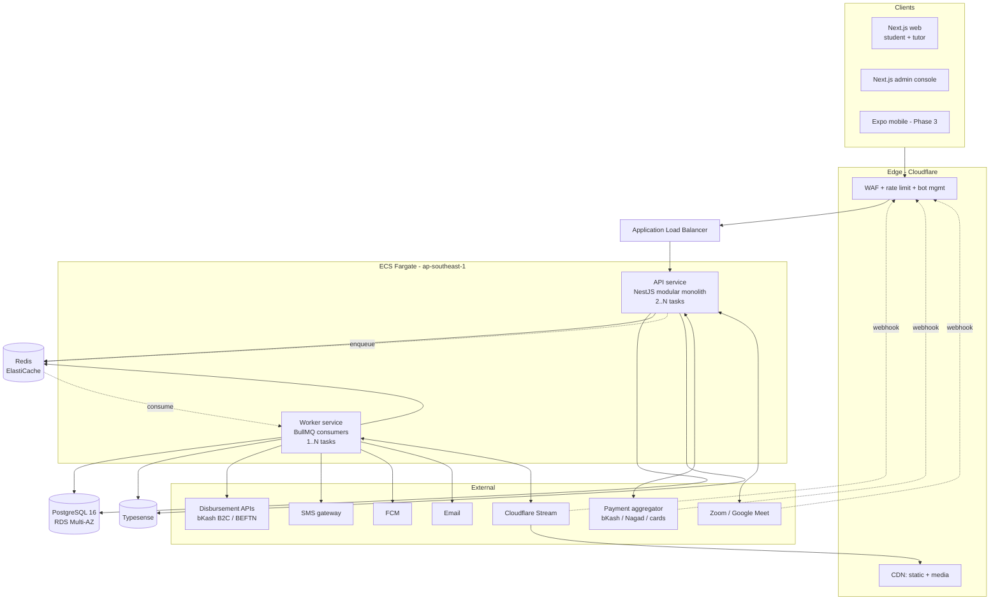
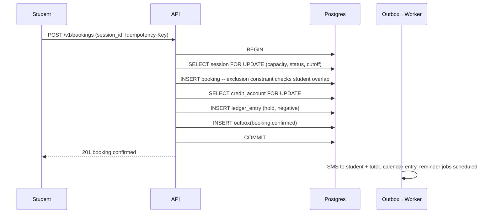
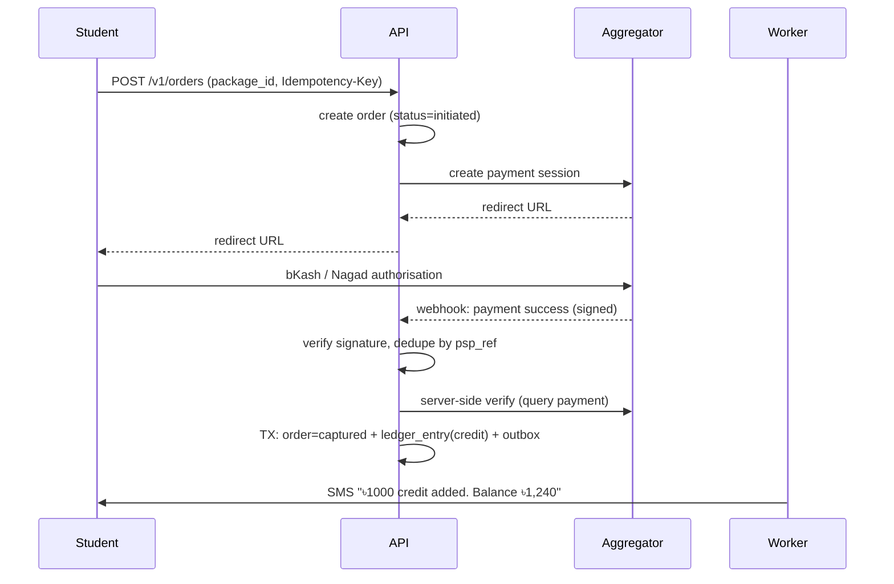

# 03 — System Architecture

## 3.1 Principles

1. **Boring, proven technology.** The hard problems here are marketplace liquidity and payment reliability, not distributed systems. Every exotic technology choice spends risk budget that belongs elsewhere.
2. **One deployable, clear module seams.** A modular monolith with enforced internal boundaries. See [ADR-002](adr/ADR-002-modular-monolith.md).
3. **The database is the source of truth for correctness.** Invariants that must never break — no double-booked tutor, no negative credit balance — are enforced by constraints, not by application code that "should" hold a lock.
4. **Money is auditable by construction.** Append-only ledger, no destructive updates, every movement traceable to an external reference.
5. **Assume a bad network.** A meaningful share of users are on 3G/4G with intermittent connectivity, on mid-range Android devices. Payload size, retry behaviour and offline tolerance are design inputs, not polish.
6. **Latency to Dhaka is a first-class constraint.** Region selection, CDN PoPs, and round-trip counts get explicit attention.

## 3.2 Stack

| Layer | Choice | Why |
|---|---|---|
| API | **NestJS** (TypeScript, Node 22) | Module system maps cleanly onto enforced domain boundaries; DI makes the payment/notification adapters swappable and testable |
| Database | **PostgreSQL 16** | Exclusion constraints (booking conflicts), `tstzrange`, `pg_trgm`, partial indexes, and transactional integrity for the ledger. All four are load-bearing here. |
| Cache / locks / queue backend | **Redis 7** | Session cache, rate limiting, OTP store, BullMQ backend |
| Background jobs | **BullMQ** | Reminders, transcode orchestration, payout batching, reconciliation, search indexing |
| Search | **Postgres first, Typesense from Phase 2** | Postgres `pg_trgm` carries the first few thousand tutors; Typesense adds typo tolerance and faceting cheaply. See [08](08-discovery-search.md#85-search-backend). |
| Web | **Next.js 15 (App Router)** | SSR for SEO on tutor profiles — organic search is a real demand channel; server components keep JS payload small for low-end Android |
| Mobile | **Expo / React Native** (Phase 3) | Shares the contracts package; Android-first |
| Object storage + CDN | **Cloudflare R2 + Cloudflare CDN**, or **Bunny.net** | Both have South Asian PoPs; R2 has zero egress fees, which matters enormously for video |
| Video transcoding | **Cloudflare Stream** (managed) | Handles the HLS ladder and signed playback; avoids owning an ffmpeg fleet at this stage |
| Payments | **Aggregator (SSLCommerz / ShurjoPay)** → direct bKash later | See [ADR-005](adr/ADR-005-payments-aggregator-first.md) |
| SMS | Local BD gateway with masked sender ID | See [13](13-notifications.md#132-sms) |
| Email | Resend or Amazon SES | Low-priority channel in this market |
| Push | Firebase Cloud Messaging | |
| Auth | In-house phone+OTP, JWT access/refresh | No BD-market identity provider is worth the dependency |
| IaC | Terraform | |
| Runtime | Docker on AWS ECS Fargate, **ap-southeast-1 (Singapore)** | Lowest-latency major region to Dhaka (~40–70ms RTT). ap-south-1 (Mumbai) is a viable alternative; measure before committing. |

## 3.3 Component topology

## 3.4 Module boundaries

Inside the monolith, these are the modules. **A module may only be reached through its published service interface or by subscribing to its domain events — never by another module's repository or by a cross-module SQL join.** This is enforced in CI by a dependency-cruiser rule, not by convention.

| Module | Owns | Publishes events |
|---|---|---|
| `identity` | Users, roles, OTP, sessions, guardian links | `user.registered`, `user.phone_verified` |
| `tutor` | Tutor profiles, subjects taught, credentials, verification, service areas, rates | `tutor.submitted`, `tutor.approved`, `tutor.suspended` |
| `catalog` | Subjects, curricula, grades, boards, locations — reference data | `taxonomy.updated` |
| `scheduling` | Offerings, sessions, availability rules and exceptions, conflict detection | `session.created`, `session.rescheduled`, `session.cancelled`, `session.completed` |
| `booking` | Bookings, enrolments, seat allocation, cancellation policy | `booking.confirmed`, `booking.cancelled`, `booking.attended` |
| `billing` | Credit accounts, ledger, hour packs, orders, PSP integration, refunds | `credits.purchased`, `credits.debited`, `refund.issued` |
| `payouts` | Earnings accrual, settlement windows, disbursement, tutor payout methods | `payout.sent`, `payout.failed` |
| `media` | Recording ingest, transcode orchestration, playback entitlement, signed URLs | `recording.ready`, `recording.failed` |
| `reviews` | Reviews, ratings aggregation, reports | `review.published`, `review.flagged` |
| `search` | Index projection, query parsing, ranking | — |
| `notifications` | Templates, channel routing, delivery tracking, preferences, quiet hours | `notification.delivered`, `notification.failed` |
| `admin` | Approval queues, disputes, audit log, dashboards | `dispute.opened`, `dispute.resolved` |
| `platform` | Cross-cutting: audit log, feature flags, config, idempotency store, outbox | — |

### Why the seams are drawn here

The three boundaries that matter most:

- **`scheduling` ⟂ `booking`.** Scheduling owns *when a tutor is occupied*; booking owns *who paid for a seat*. Merging them is the most common design error in this category of product, and it makes group classes and cancellation policy impossible to reason about later.
- **`billing` ⟂ `payouts`.** Money in and money out have different failure modes, different reconciliation cycles, different regulatory exposure and different on-call urgency. They share only the ledger's read model.
- **`media` is fully async.** Nothing in the request path ever waits on a transcode.

### Events and the outbox

Domain events are written to a `platform.outbox` table **in the same transaction** as the state change, then relayed to Redis by a poller. This makes "session completed → credits captured → SMS sent → payout accrued" reliable without distributed transactions, and it means a Redis outage delays notifications rather than losing bookings.

Consumers must be **idempotent** and are keyed on `(event_id, consumer_name)` in a `processed_events` table.

## 3.5 Request path for the two critical flows

### Booking a session

Everything that must be atomic is in one transaction against one database. Everything else — notifications, search reindex, calendar sync — is downstream of the outbox and may retry. **No booking is ever confirmed to a user before the credit hold is durable.**

### Buying credits

**The webhook is a hint, not a source of truth.** Credits are only issued after an independent server-to-server verification call confirms the amount and status. A reconciliation job re-checks every `initiated` order older than 15 minutes against the PSP, because in this market a non-trivial share of mobile-wallet payments succeed at the wallet and never deliver a webhook.

## 3.6 Environments

| Env | Purpose | Data | Payments |
|---|---|---|---|
| `local` | Developer machines | Docker Compose, seeded fixtures | Fake PSP adapter |
| `dev` | Integration, always deployed from `main` | Synthetic | PSP sandbox |
| `staging` | Pre-release, prod-shaped | Anonymised prod subset | PSP sandbox |
| `production` | | Real | Live |

Staging carries **anonymised** data only: phone numbers rewritten to a reserved test range, names replaced, NID images excluded entirely. See [14](14-security-compliance.md).

## 3.7 Deployment and release

- Trunk-based development, short-lived branches, `main` always deployable.
- CI: typecheck → lint → unit → integration (Testcontainers Postgres + Redis) → build → migrate-check → deploy.
- **Migrations are expand/contract and always backwards-compatible with the previous release.** No deploy is allowed to require simultaneous app+schema cutover.
- Rolling deploys with health checks; automatic rollback on error-rate breach.
- Feature flags for anything touching money or the booking path.
- **Release windows avoid 16:00–22:00 Asia/Dhaka**, which is the peak tutoring block. A bad deploy at 19:00 breaks live classes in progress.

## 3.8 Observability

| Signal | Tool | Notes |
|---|---|---|
| Logs | Structured JSON → CloudWatch → queryable store | `trace_id`, `user_id`, `module` on every line. **Never log OTPs, tokens, NID numbers, or full phone numbers** (log last 4 only). |
| Metrics | OpenTelemetry → Prometheus/Grafana | RED metrics per endpoint plus the business metrics below |
| Traces | OpenTelemetry | Full trace on the booking and payment paths |
| Errors | Sentry | Source-mapped, PII scrubbed |
| Uptime | External synthetic checks from a South Asian probe | Checking from us-east-1 hides exactly the latency that hurts |

**Business metrics deserve alerts as much as infrastructure metrics.** Alert on:

- Payment success rate < 90% over 15 min (per PSP method — bKash and Nagad fail independently)
- SMS delivery rate < 95% over 30 min
- Bookings/hour deviating > 3σ from the same hour last week
- Any ledger reconciliation mismatch — **page immediately, no threshold**
- Sessions starting in < 10 min with no live link attached
- Transcode queue depth > 50 or oldest job > 45 min

## 3.9 Performance budgets

| Path | Target (p95) |
|---|---|
| Search results (Dhaka, 4G) | < 800 ms to first result paint |
| Tutor profile page (SSR, cold) | < 1.2 s LCP |
| Booking creation API | < 400 ms |
| Credit purchase → PSP redirect | < 1.5 s |
| Recording playback start | < 3 s |
| API server-side p99 | < 600 ms |

Client budgets: initial JS ≤ 180 KB gzipped on the student surface; every list view paginated at 20; all images AVIF/WebP with explicit dimensions.

## 3.10 Scale expectations

Sizing for the realistic first 18 months, not for a hypothetical:

| Dimension | Year 1 | Design headroom |
|---|---|---|
| Tutors | 2,000–5,000 | 50,000 |
| Students | 30,000–80,000 | 1M |
| Sessions/day | 1,500 peak | 25,000 |
| Peak concurrency | 16:00–21:00 Asia/Dhaka, ~8× daily mean | — |
| Recording storage | ~40 TB/yr at 1,500 sessions/day, 1 h, 700 kbps HLS | Tiered lifecycle, see [10](10-media-recordings.md#106-retention-and-cost) |

A single well-indexed Postgres instance with a read replica handles this comfortably. Sharding, event sourcing and service extraction are all explicitly deferred; [ADR-002](adr/ADR-002-modular-monolith.md) records the trigger conditions that would justify revisiting.

---

Next: [04 — Data Model](04-data-model.md)
