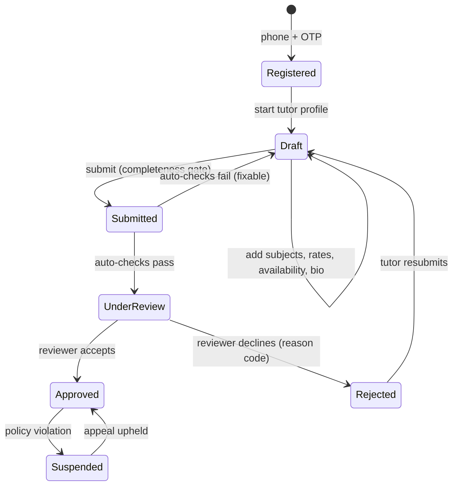

# 06 — Tutor Onboarding & Verification

*Implements capability 1: profile, subjects, credentials/verification, pricing.*

## 6.1 The design constraint

Onboarding sits between two opposing forces:

- **Supply is the constraint.** Every additional step loses tutors. A teacher who has never used a marketplace before will abandon a form that asks for a bank statement on screen two.
- **Trust is the conversion driver.** A parent will not pay ৳900/hour to an unverified stranger, and one safeguarding incident is an extinction-level event for a marketplace like this.

The resolution is **progressive verification**: registration is deliberately short, and *capability* — not access — expands as verification deepens. A tutor can build their entire profile in ten minutes; the things that require trust (higher prices, in-person teaching, faster payouts) unlock as they prove more.

Target: **< 12 minutes** from landing to submitted profile, on a mid-range Android phone, in Bangla.

## 6.2 The flow



### Step-by-step

| Step | Asked for | Required to submit? | Notes |
|---|---|---|---|
| 1. Account | Phone + OTP, full name | Yes | Same account as any other user; "become a tutor" is a role, not a separate signup |
| 2. Identity | NID or passport photo, selfie | Yes | Camera-first UI. Most tutors have their NID on their phone already. |
| 3. Teaching profile | Subjects (from taxonomy), grade levels, curriculum, boards | Yes | Multi-select from the curated list; search in bn and en |
| 4. Pricing | Per-subject hourly rate | Yes | Rate guidance shown inline — see §6.5 |
| 5. Mode & area | Online / in-person / both; service areas; travel radius | Yes | Areas from the location tree |
| 6. Availability | Weekly recurring windows | Yes | Sunday-first grid, tap-to-select, 30-min granularity |
| 7. Profile | Headline, bio (bn and/or en), photo | Bio ≥ 120 chars | Templated starters offered; a blank bio converts terribly |
| 8. Credentials | Degree/certificate uploads, institution, year | No — but gates L2 | Skippable at submit, prompted persistently afterward |
| 9. Intro video | 30–90 s self-introduction | No | Strongest single conversion lever; heavily encouraged |
| 10. Payout method | bKash/Nagad number or bank account | No — required before first payout | Deliberately deferred; asking for it upfront kills completion |

**Deferring the payout method to after the first booking is a deliberate decision.** It is the highest-friction, highest-suspicion field in the whole flow, and asking for it before the tutor has any reason to trust the platform measurably reduces completion. It becomes mandatory only when there is money waiting.

### Auto-checks before human review

Run synchronously on submit; fixable failures return the tutor to `draft` with specific guidance rather than sitting in a queue:

- Phone verified, unique across the platform
- NID image: readable, not a screenshot of a screenshot, face detectable
- Selfie ↔ NID photo similarity above threshold (assistive signal for the reviewer, **never** an automatic rejection)
- NID number hash not already linked to a suspended account
- Bio: minimum length, not duplicated from another profile, no contact details (phone/email/social handles) embedded
- Rates within the plausible band for the subject and grade (§6.5)
- At least one subject, one availability window, one service area
- Profile photo: a face, not a logo/text/stock image

### Human review

An admin reviews in the [admin console](12-admin-console.md#122-tutor-approval). **SLA: 24 business hours; target median under 6.** Slow approval is the single biggest leak in the supply funnel — a tutor who waits three days has already gone back to the coaching centre.

Reviewer decision surface: side-by-side NID and selfie, the profile as students will see it, auto-check results, duplicate-signal matches (same NID hash, same device fingerprint, same payout number as an existing tutor), and a rejection reason picker.

Rejection reason codes are fixed and each maps to a specific Bangla SMS explaining exactly what to fix: `nid_unreadable`, `nid_mismatch`, `photo_invalid`, `bio_insufficient`, `bio_contains_contact`, `subject_mismatch`, `rate_implausible`, `duplicate_account`, `policy_violation`.

## 6.3 Verification tiers

| Tier | Requirements | Badge | Unlocks |
|---|---|---|---|
| **L0** Registered | Phone verified | none | Draft profile only; cannot publish |
| **L1** ID Verified | L0 + NID/passport verified + selfie match + admin approval | ✅ **আইডি যাচাইকৃত** | Publish offerings, online classes, rates up to the subject's P75, weekly payouts |
| **L2** Credential Verified | L1 + at least one academic credential verified | 🎓 **সনদ যাচাইকৃত** | Rates up to P95, search ranking boost, "Verified Educator" surfacing |
| **L3** Trusted | L2 + ≥50 completed sessions + rating ≥ 4.5 + zero upheld disputes in 90 days + reference or background check | ⭐ **বিশ্বস্ত শিক্ষক** | Unrestricted rates, in-person teaching with minors, priority support, twice-weekly payouts, featured eligibility |

**In-person teaching with under-18 students requires L3.** This is the safeguarding line and it is not negotiable for launch. In-person tutoring is where the money and the risk both concentrate; permitting it at L1 would be indefensible after an incident.

Tiers can be revoked. A credential later found to be forged drops the tutor to L1 and triggers a full review of their completed sessions.

### Verification methods

| Credential | Method | Automation |
|---|---|---|
| NID | Image capture + OCR + selfie liveness/match; optionally an EC-backed verification service via an authorised provider | Semi-automated; human confirms |
| Passport | Manual review | Manual |
| University degree | Institution + year + document image; spot-checked against the institution's public verification portal where one exists | Manual, sampled |
| Teaching certificate | Document review | Manual |
| Employment letter | Document review + optional call to the institution | Manual |

> Direct government NID verification in Bangladesh is intermediated through authorised service providers and requires a commercial agreement and the individual's consent. Treat it as a **Phase 2 upgrade** behind an adapter interface (`IdentityVerifier`), with manual review as the Phase 1 implementation and the permanent fallback. Confirm the current commercial and regulatory terms with the provider before building against them — do not assume the terms described in any documentation, including this one, are current.

## 6.4 Profile model

What students see, in priority order — this ordering was chosen because it matches how a parent actually evaluates a tutor:

1. Photo, name, verification badges
2. Headline: *"HSC Physics · 8 years · 200+ students to A+"*
3. Rating, review count, sessions completed
4. Subjects and grade levels taught, with per-subject rates
5. Response time and typical availability
6. Intro video
7. Bio
8. Credentials (institution and title only — **never** document numbers or images)
9. Service areas and delivery modes
10. Reviews, newest first, with tutor replies

**Never exposed publicly:** phone number, email, NID number, address, payout details, exact document images. Contact exchange happens only after a confirmed booking, and even then through masked channels — see [11 §11.6](11-ratings-reviews.md#116-leakage-and-disintermediation).

### Profile completeness

A visible score drives the tutor toward the fields that actually convert:

| Component | Weight |
|---|---|
| Intro video | 25 |
| Bio ≥ 300 chars | 15 |
| Photo | 10 |
| ≥ 3 subjects with rates | 15 |
| ≥ 10 weekly availability hours | 15 |
| ≥ 1 verified credential | 20 |

Below 60, the profile is deprioritised in search. The score is shown to the tutor with the single highest-impact missing item called out — not as a checklist of ten items, which is ignored.

## 6.5 Pricing

Tutors set their own rates. Full stop — that is the product. But an empty price field with no context produces both ৳50/hour (undervaluing, and a spam signal) and ৳5,000/hour (no bookings, tutor churns).

**Rate guidance** is shown inline as a distribution for the exact `(subject, grade_level, curriculum, delivery_mode, area)` combination:

```
HSC Physics · Class 12 · Online · Dhanmondi
  ├─ 25th percentile   ৳ 450/hr
  ├─ median            ৳ 700/hr   ← most bookings happen here
  └─ 75th percentile   ৳ 1,100/hr
Tutors at L2 with 4.5★+ average ৳ 950/hr
```

Rules:

- **Floor**: ৳100/hour. Below this, unit economics fail (SMS + PSP + storage per session) and it is a strong fraud/spam signal.
- **Ceiling by tier**: L1 → subject P75, L2 → P95, L3 → none. Prevents an unverified account posting a ৳10,000 rate to appear premium.
- **Rate changes never affect existing bookings.** `class_sessions.price_poisha` snapshots the price at session creation; `bookings.price_poisha` snapshots again at booking.
- **Cooldown**: one rate change per subject per 7 days, to prevent bait-and-switch and search-ranking gaming.
- Group offerings price **per seat**. The tutor sees projected earnings at 50% and 100% capacity while setting it, because the per-seat vs. per-session distinction is the single most common pricing mistake new tutors make.
- Optional per-offering package discounts (10 sessions at −10%), which materialise as an [hour pack](09-payments-credits.md#94-hour-packs).

Until there is enough data for real percentiles, guidance comes from a seeded table derived from market research per city and subject, replaced with live percentiles once a `(subject, grade, area)` cell has ≥ 30 active tutors.

## 6.6 Coaching centres as sellers (Phase 3)

Not every teacher wants to be an independent business, and the centres themselves are a large, ready-made supply channel. The organisation model:

- An **Organisation** entity with its own trade licence verification and payout account.
- Teachers are linked as members; the organisation may hold their calendar and set their rates.
- Revenue split is configurable per member (e.g. 70% teacher / 30% centre), settled automatically by the payouts module.
- The centre gets an operations dashboard: batches, attendance, collections.

This deliberately does not fight the informal economy — it absorbs it, and converts a competitor into a distribution channel. Deferred to Phase 3 because building for organisations before individual liquidity exists would fragment the product.

## 6.7 Tutor lifecycle after approval

| Event | Effect |
|---|---|
| 30 days with no published offering | Nudge campaign, then `paused` in search |
| 60 days with no session | Marked dormant, hidden from search, reactivation flow offered |
| Rating drops below 3.5 over ≥ 10 reviews | Quality review; coaching outreach before any action |
| 2 upheld no-show disputes in 30 days | Automatic suspension pending review |
| Credential found invalid | Tier downgrade + review of all completed sessions |
| Suspension | All future sessions cancelled, students fully refunded to credits, profile delisted, earnings held pending review |

Suspension is intentionally expensive to the tutor and free to the student. The refund is automatic and immediate — the student should never have to ask.

---

Next: [07 — Classes, Scheduling & Booking](07-classes-scheduling.md)
