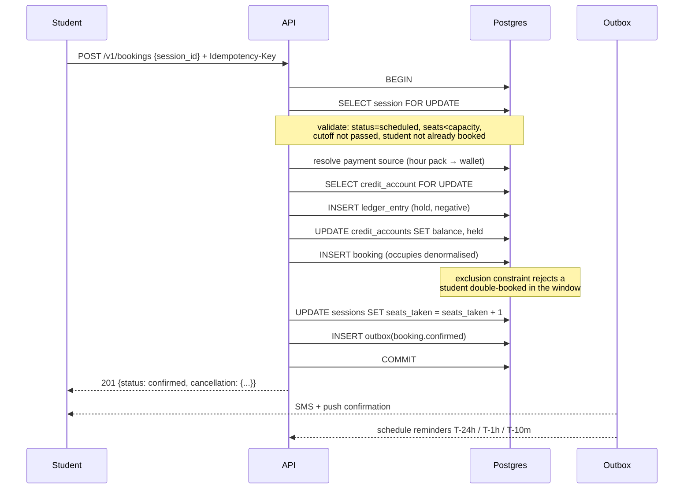
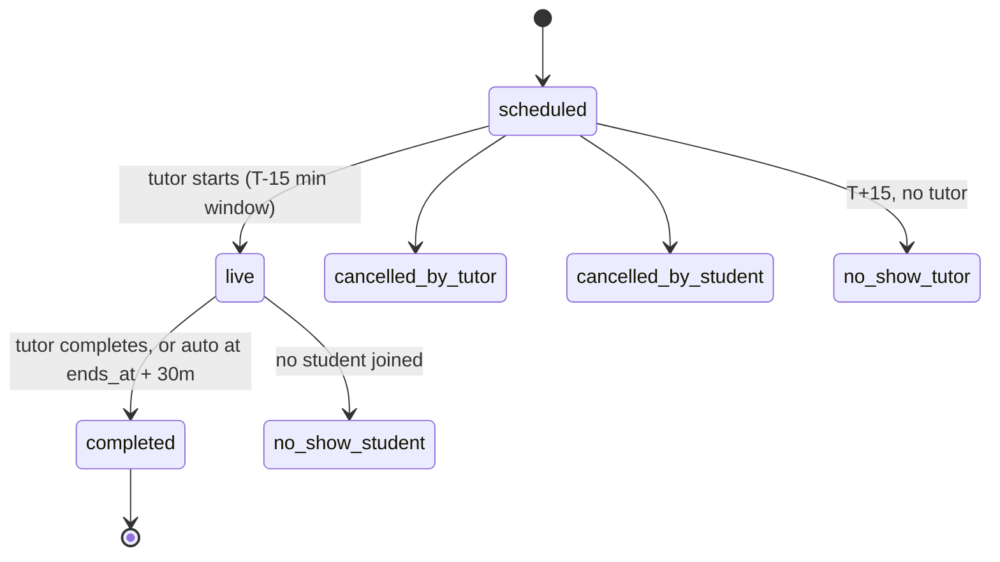

# 07 — Classes, Scheduling & Booking

*Implements capabilities 2 and 4: class creation (live or pre-recorded) and booking with conflict checks.*

## 7.1 The three-layer model

The most important structural decision in the product:

```
Offering   — what is sold, and for how much        (a template: "HSC Physics 1:1, 60 min, ৳900")
   ↓ instantiates
Session    — a specific instant in the calendar    (Thu 14 Aug, 16:00–17:00 +06)
   ↓ holds seats for
Booking    — one student's paid claim on a seat    (Tanvir, ৳900, confirmed)
```

Collapsing offering and session — the obvious shortcut — makes recurring classes, group capacity, price history and cancellation policy all impossible to express cleanly. Collapsing session and booking makes group classes impossible. The three layers cost one extra join and buy every feature the product will need for years.

**Only sessions occupy the tutor's calendar.** Offerings are inert; bookings are financial.

## 7.2 Delivery modes

| Mode | Calendar? | Live link? | Recording? | Payment timing |
|---|---|---|---|---|
| `live_online` | Yes | Yes (Zoom/Meet) | Optional, usually yes | Hold at booking, capture at completion |
| `live_in_person` | Yes | No — venue instead | No | Hold at booking, capture at completion |
| `recorded` | No | No | The product itself | Charged immediately at enrolment |

`recorded` offerings bypass sessions and bookings entirely and use `enrolments`. They are a lower-value, higher-margin secondary product — a tutor's existing recordings sold as a course. They matter mostly because they let a tutor earn while asleep, which is a powerful retention argument for supply.

## 7.3 Creating sessions

A tutor creates sessions three ways:

**1. Single session.** Pick a date and time from their availability grid.

**2. Recurring series.** "Every Sunday and Tuesday, 16:00–17:00, for 12 weeks." Expands to concrete session rows at creation time — **not** stored as an RRULE evaluated lazily.

> Materialising the series is deliberate. Lazy RRULE evaluation means the conflict constraint has nothing to constrain against, and every calendar query has to expand rules at runtime. Materialised rows make each occurrence independently cancellable, reschedulable and priceable, and let the database enforce non-overlap. The cost is bounded: series are capped at 52 occurrences or 6 months, and a background job extends open-ended series in rolling 90-day windows.

**3. On-demand / bookable slots.** The tutor publishes availability only; students request a specific slot, and confirming the request creates the session. Higher friction but higher fill rate for tutors with irregular schedules. Requests expire in 12 hours.

### Session creation rules

- Must fall inside an `availability_rule` window, or the tutor must explicitly override with a confirmation.
- Must not overlap an existing `scheduled`/`live` session including buffers — **enforced by the database constraint** ([§7.6](#76-conflict-detection)).
- Must not fall inside an `availability_exception` where `is_available = false`.
- Must start at least 30 minutes in the future.
- Duration between 15 and 300 minutes, in 15-minute increments.
- Capacity 1 for `one_to_one`; 2–200 for `group`.
- `price_poisha` snapshots from the offering at creation.

### Buffers

Every session carries `buffer_before_min` (default 0) and `buffer_after_min` (default 10). The buffer is part of `occupies`, so back-to-back sessions with a 10-minute gap are legal and 5-minute gaps are not. This exists because in-person tutors need travel time and online tutors need a break — and because without it, the platform cheerfully books a tutor into 8 consecutive hours and then absorbs the no-show disputes.

In-person sessions in different areas get a travel buffer scaled by distance between area centroids (minimum 30 min within an area, 60 min across areas in Dhaka — Dhaka traffic makes anything less a guaranteed late arrival).

## 7.4 Availability

Two constructs, composed:

```
effective_availability(tutor, window) =
      union(availability_rules projected onto the window in Asia/Dhaka)
    + union(exceptions where is_available = true)
    − union(exceptions where is_available = false)
    − union(occupies of scheduled/live sessions)
    − (now + minimum_notice)
```

`minimum_notice` is per-tutor, defaulting to 4 hours: the shortest lead time they will accept a booking on.

Rules are stored as wall-clock time plus an IANA zone, so a rule means "every Sunday at 4pm my time". They are projected into instants at query time, not at write time.

`GET /tutors/{id}/availability?from&to&duration` returns discrete bookable slots at the requested duration, aligned to 15-minute boundaries, already filtered for conflicts, buffers and notice. **The client never computes availability.** It is derived state with a single server-side implementation, because two implementations of this logic will disagree and the disagreement will be a double booking.

### Calendar UI requirements

- Week starts **Sunday**; Friday–Saturday styled as the weekend.
- Times displayed in the viewer's zone with the tutor's zone shown when they differ.
- Bangla numerals when `locale = bn-BD`.
- Peak block (16:00–22:00) is visually prominent — it is where the vast majority of demand lands.
- One-tap application of a seasonal blackout template for Ramadan and Eid, offered proactively before the period rather than buried in settings.

## 7.5 Booking



Everything requiring atomicity is one transaction on one database. Notifications, calendar sync and search reindexing all hang off the outbox and may retry freely.

### Validation, in order

1. Session exists and is `scheduled`
2. `seats_taken < capacity`
3. `now < starts_at − booking_cutoff` (default 30 min; per-offering override)
4. Student has no existing booking on this session (`UNIQUE (session_id, student_id)`)
5. Student has no overlapping confirmed booking (exclusion constraint)
6. Student (or their guardian) has sufficient funds, or a matching hour pack
7. Guardian approval, if the student is under 16 or the link requires it
8. Tutor is `approved` and not suspended

### Payment source resolution

`payment_source: "auto"` resolves: **non-expired hour pack for this tutor (soonest expiry first) → wallet credits → `409 insufficient_credits`**. Packs are consumed before wallet credits so that prepaid, tutor-specific value does not expire unused — which is both fairer and reduces refund requests.

The `409` body carries `required_poisha` and `available_poisha`; clients deep-link into top-up with the exact shortfall pre-filled and return to the booking afterwards. Because mobile-wallet top-ups take 30–90 seconds and seats can be taken meanwhile, the API offers a **10-minute soft seat hold** (`POST /bookings` with `hold_only: true`) that reserves capacity without a ledger entry. Holds are released by a sweeper job.

### Group classes

`seats_taken` is incremented inside the booking transaction under `SELECT … FOR UPDATE` on the session row. A group session with `min_seats` set is provisional until the minimum is met by a configured deadline; if it isn't, the session auto-cancels and all holds are released untouched. Students see "3 of 5 seats filled — confirms Tuesday" rather than a silent cancellation.

## 7.6 Conflict detection

Four distinct conflicts, each with a defined mechanism:

| # | Conflict | Mechanism |
|---|---|---|
| C1 | Tutor double-booked | `EXCLUDE USING gist (tutor_id WITH =, occupies WITH &&) WHERE status IN ('scheduled','live')` on `class_sessions` |
| C2 | Student double-booked | Same constraint shape on `bookings`, filtered to `('confirmed','attended')` |
| C3 | Session oversold | `SELECT … FOR UPDATE` on the session row + `CHECK (seats_taken <= capacity)` |
| C4 | Booking outside availability | Application-level check at session creation (availability is intent, not an invariant, and tutors may legitimately override it) |

C1 and C2 are database constraints because **they must hold under concurrency and must survive every future code path** — admin tooling, bulk import, a migration script, a feature written two years from now by someone who never read this document. A `SELECT … WHERE overlaps` check in application code is a race condition with a comment on it.

The constraint surfaces as SQLSTATE `23P01` (`exclusion_violation`), which the repository layer translates:

```ts
try {
  await tx.insert(classSessions).values(row);
} catch (e) {
  if (isPgError(e, '23P01', 'class_sessions_no_tutor_overlap')) {
    throw new ConflictError('session_conflict', {
      conflicting: await findOverlapping(tx, row.tutorId, row.occupies),
    });
  }
  throw e;
}
```

The error response includes the conflicting session so the UI can say *"You already have HSC Chemistry at 4:00 PM"* rather than "conflict".

`occupies` is maintained by the application, not by a generated column, because `timestamptz ± interval` is only `STABLE` and an exclusion constraint requires `IMMUTABLE` inputs. A single `buildOccupies(startsAt, endsAt, bufferBefore, bufferAfter)` helper in `packages/domain` is the only code permitted to construct it, and a database trigger asserts consistency with `starts_at`/`ends_at` as a defence against a future code path forgetting.

### Rescheduling

`PATCH /sessions/{id}` with new times, in one transaction:

1. Recompute `occupies`, re-run C1 (the constraint does this).
2. Update every child booking's `occupies`; the C2 constraint may now reject — if so, the whole reschedule fails with the list of students who conflict. The tutor then chooses to proceed and cancel those bookings, or pick another time.
3. Notify all booked students by SMS with the old and new times and a one-tap accept/refund choice.
4. Students who do not accept within 24 h (or before the new start, whichever is sooner) are auto-refunded.

**Rescheduling is not a silent operation.** A tutor moving a class is a real cost to a student who has arranged their day around it.

## 7.7 Cancellation policy

| Policy | Free cancellation window | After the window |
|---|---|---|
| `flexible` | Up to 2 h before | 50% refund |
| `standard` *(default)* | Up to 24 h before | 50% refund |
| `strict` | Up to 48 h before | No refund |

Universal overrides — these always win over the tutor's chosen policy:

- **Tutor cancels, ever:** 100% refund to credits, immediately, plus a ৳50 credit apology grant for cancellations inside 24 h. Repeat offences affect ranking.
- **Tutor no-show** (no `tutor_joined_at` within 15 min of start): 100% refund, automatic, no dispute required. The system detects this itself and acts without the student having to complain — a student who has to fight for a refund does not come back.
- **Technical failure attributable to the platform:** 100% refund.
- **Student no-show:** charged in full; the tutor's time was reserved. The recording, where one exists, is still made available — this converts an angry refund request into a salvaged lesson.

Refunds default to credits (instant, no PSP cost, value stays on-platform). Refund-to-source is available on request and always granted for tutor no-shows if the student asks.

## 7.8 Live class delivery

v1 is **bring-your-own link** — see [ADR-003](adr/ADR-003-live-class-delivery.md). Tutors already have Zoom or Meet, students already know how to join, and the platform avoids owning real-time media infrastructure at the exact moment it should be proving marketplace liquidity instead.

| Concern | Handling |
|---|---|
| Link storage | `class_sessions.meeting_url`, validated against an allowlist of Zoom/Meet/Teams URL shapes |
| Link disclosure | **Only via `POST /bookings/{id}/join`, only from T−15 min, only to confirmed bookers.** Never in an SMS, never on a public page — an unprotected Zoom link is a public class. |
| Uniqueness | Warn when the same link is reused across overlapping sessions (a common tutor mistake that lets the wrong students in) |
| Attendance | `joined_at` recorded when the join endpoint is called; for Zoom OAuth-connected tutors, the participant report webhook gives real attendance |
| Recording | Zoom cloud recording via the `recording.completed` webhook, or manual upload — see [10](10-media-recordings.md) |
| Tutor presence | If `tutor_joined_at` is null 10 min after start, SMS the tutor; at 15 min, auto-refund and mark `no_show_tutor` |

Optional Zoom OAuth connection (Phase 2) upgrades this: the platform creates the meeting itself, gets per-participant attendance, and pulls recordings automatically. It is an upgrade, not a requirement — a tutor with a free Zoom account and a pasted link must remain fully functional forever, because that is most of the market.

A native classroom (LiveKit or 100ms) is Phase 4, justified only if measurement shows link friction is materially costing bookings.

## 7.9 Session lifecycle and money



| Transition | Money |
|---|---|
| Booking confirmed | **Hold** — credits move out of the student's available balance into `held` |
| `completed` | **Capture** — hold converts to spend; an `earnings` row accrues for the tutor with commission split |
| `cancelled_by_student` in free window | **Release** — hold returned in full |
| `cancelled_by_student` late | Partial capture per policy; the rest released |
| `cancelled_by_tutor` / `no_show_tutor` | **Release** in full + apology grant where applicable |
| `no_show_student` | **Capture** in full |
| Dispute opened | Earnings row moves to `held`; settlement suspended until resolution |

Auto-completion runs at `ends_at + 30 min` for sessions still `live`, because tutors forget to press the button and a session that never completes never pays anyone. Auto-completed sessions extend the student's dispute window from 24 h to 48 h, since nobody explicitly confirmed the class happened.

## 7.10 Reminders

Scheduled from the outbox at booking time, cancelled if the booking is cancelled:

| When | Student | Tutor |
|---|---|---|
| T−24 h | SMS + push | Push (daily digest for tutors with ≥3 sessions) |
| T−1 h | SMS + push | SMS + push |
| T−10 min | Push + SMS with join instructions | Push + SMS |
| T+5 min, tutor absent | — | Urgent SMS |
| T+15 min, tutor absent | Refund notification | Suspension warning |

Reminder SMS respects [quiet hours](13-notifications.md#136-quiet-hours) except for the T−10 min message, which is time-critical by definition.

---

Next: [08 — Discovery & Search](08-discovery-search.md)
