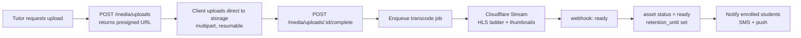
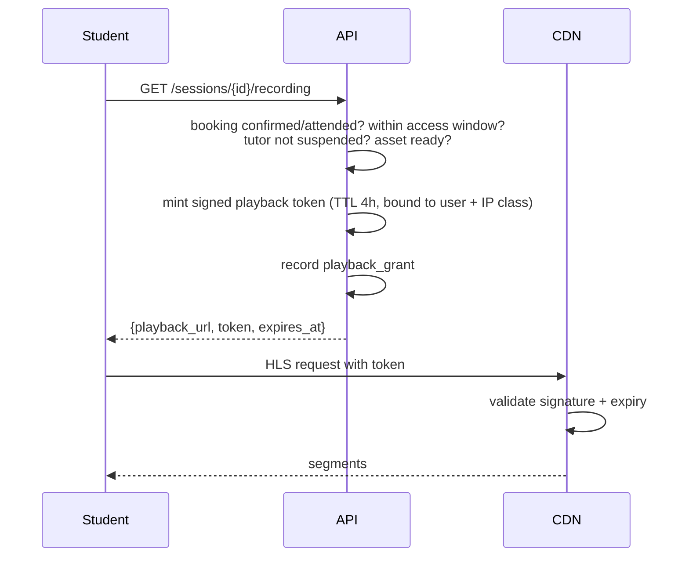

# 10 — Recordings & Media

*Implements capability 6: class recording storage and playback for students who missed the live session, plus pre-recorded uploads.*

## 10.1 Why this matters more than it looks

Recording is not a convenience feature in this market. It is:

- **A refund deflector.** A student who missed a class and can watch the recording does not open a dispute. This alone justifies the storage cost.
- **A trust artefact.** Recorded sessions are evidence when a quality dispute arises. "The tutor did not teach the syllabus" becomes checkable.
- **An anti-leakage moat.** A tutor and student who move to a private Zoom call lose the recording library. Small, but it compounds over a semester.
- **A second revenue line.** A tutor's accumulated recordings become a `recorded` offering that earns while they sleep — the strongest retention argument available for supply.

It is also, by a wide margin, the largest variable cost in the system. Everything below is shaped by that tension.

## 10.2 Sources

| Source | Path | Phase |
|---|---|---|
| **Zoom cloud recording** | `recording.completed` webhook → download with an OAuth token → push to storage | 2 (requires the tutor to connect Zoom) |
| **Manual upload** | Tutor records locally, uploads via presigned URL | **1 — the baseline that must always work** |
| **Google Meet** | Recording lands in the tutor's Drive; the tutor shares or uploads | 3, and constrained — Meet recording needs a paid Workspace tier most BD tutors will not have |
| **Pre-recorded lessons** | Direct upload against a `recorded` offering | 1 |
| **Native classroom** | Server-side recording | 4, only if a native classroom is built |

**Manual upload is the permanent fallback and the Phase 1 default.** A tutor with a free Zoom account and a local recording must be fully functional forever — that is most of the market, and designing around the assumption that tutors have paid Zoom would exclude the majority of supply.

## 10.3 Upload pipeline

- **Direct-to-storage, never through the API.** A 400 MB upload must not occupy an API worker.
- **Resumable, chunked** (5 MB parts, tus-style or S3 multipart). Uploads on Bangladeshi mobile networks *will* be interrupted; a non-resumable upload means a tutor who tries twice and gives up.
- Client-side pre-checks: duration ≤ 4 h, size ≤ 4 GB, container mp4/mkv/mov/webm.
- Server validates the actual content type by magic bytes — never by extension or client-declared MIME.
- Progress is visible and survives app backgrounding.
- **Wi-Fi-only upload is the default on mobile**, with an explicit override. Mobile data is expensive relative to income here, and silently consuming a tutor's data package to upload 400 MB is a serious breach of trust.

## 10.4 Transcoding

Managed via Cloudflare Stream rather than a self-hosted ffmpeg fleet — the operational cost of running transcode infrastructure is not a good use of this team's attention at this stage.

**Bitrate ladder tuned for Bangladeshi networks**, deliberately weighted low:

| Rendition | Resolution | Bitrate | Purpose |
|---|---|---|---|
| 240p | 426×240 | 300 kbps | 3G, congested networks |
| 360p | 640×360 | 600 kbps | **The realistic default for most viewers** |
| 480p | 854×480 | 1.0 Mbps | Good 4G |
| 720p | 1280×720 | 2.0 Mbps | Wi-Fi |
| audio-only | — | 64 kbps | Explicitly offered — a lecture is largely audio, and data is expensive |

A standard ladder starting at 720p is wrong for this market. The 240p rung and the audio-only track are the ones that keep the feature usable at 8 PM on a congested Dhaka cell.

Also produced: a poster thumbnail at 10%, a sprite sheet for scrub preview, and (Phase 3) Bangla and English captions via ASR — captions are a large accessibility and comprehension win, and Bangla ASR quality should be evaluated before committing.

Failed transcodes retry twice, then notify the tutor with a specific reason and keep the original file for 7 days so it can be reprocessed rather than re-uploaded.

## 10.5 Entitlement and playback

**Every playback request is authorised server-side. There is no such thing as a public recording URL.**

| Rule | Detail |
|---|---|
| Who can watch a session recording | Students with a `confirmed` or `attended` booking on that session, their linked guardians, and the tutor |
| Who can watch a `recorded` offering | Students with an active `enrolment` |
| Token TTL | 4 hours, single user, renewable |
| Access window | 30 days after the session by default; longer for `recorded` offerings per the enrolment |
| Watermark | The student's name and phone-last-4 rendered as a translucent overlay that moves position every 30 s |
| Attribution | Every issued token is logged to `playback_grants` with IP and user agent |
| DRM | Not in v1. Widevine/FairPlay adds cost and complexity disproportionate to the threat at this stage. |

The watermark is the pragmatic anti-piracy control. It does not prevent screen recording — nothing short of DRM does, and DRM does not either — but it makes a leaked file traceable to one account, which is enough deterrent for the actual threat model (a student sharing a link in a Facebook group).

Also enforced: concurrent-stream limits (2 per account), and an alert on anomalous grant patterns (one account requesting 40 recordings in an hour is credential sharing or scraping).

## 10.6 Retention and cost

Storage grows monotonically and will quietly become the largest line item on the infrastructure bill. It is managed explicitly rather than discovered later.

**Rough scale:** 1,500 sessions/day × 1 h × ~700 kbps (all renditions, HLS) ≈ 315 MB/session ≈ **470 GB/day ≈ 170 TB/year**. Storage is cheap; **egress is not** — which is precisely why R2 (zero egress) or Bunny is specified rather than S3+CloudFront.

**Lifecycle:**

| Age | Action |
|---|---|
| 0–30 days | All renditions hot, CDN-cached |
| 31–90 days | Drop 720p; keep 360p and audio-only |
| 91–180 days | Move to cold storage; playback restores on request within minutes |
| > 180 days | Delete, unless the tutor has marked it as part of a `recorded` offering or it is attached to an open dispute |

Retention is a **plan feature, not a hidden default**: 30 days baseline for all tutors, 180 days for L3, unlimited for recordings that back a paid `recorded` offering. Tutors are told the retention period at upload and warned 7 days before deletion.

**Legal holds override everything.** An asset attached to an open dispute or a legal request is never deleted, regardless of age or plan.

## 10.7 Consent and privacy

Recording a class captures minors' voices, faces and names. This is the most sensitive data the platform handles.

| Rule | Detail |
|---|---|
| **Disclosure before booking** | Every session that will be recorded is labelled 🔴 **রেকর্ড করা হবে** on the offering, in search results, and on the booking confirmation. No one is recorded by surprise. |
| **Guardian consent for under-18s** | Captured at account setup for a minor student, re-confirmed at first booking of a recorded session |
| **Opt-out** | A student may decline recording. For one-to-one sessions this disables recording entirely. For group sessions the student is informed before booking and may choose a non-recorded alternative — a group class cannot record everyone except one person. |
| **Camera-off is honoured** | The recording captures whatever the meeting produced; students are never required to enable video |
| **No downloads** | Playback is streaming-only for students. Only the tutor may download their own recording. |
| **Deletion rights** | A student may request removal of their own contributions; where that is not technically separable in a group recording, the recording is deleted. A tutor may delete their own recordings, which revokes student access with 7 days' notice. |
| **Never used for training** | Recordings are not used to train models, and are not shared with third parties beyond the storage/transcode processors under contract |

These rules are written to be defensible under the direction Bangladesh's data-protection framework is heading, and under the general principle that a parent's expectations about a recording of their child are strict. **Confirm the current statutory position with counsel before launch** — see [14 §14.7](14-security-compliance.md#147-regulatory-posture).

## 10.8 Playback experience

Built for the actual device and network conditions, not the demo:

- **Resume from last position** — synced server-side via `POST /media/assets/{id}/progress`, so a student can switch from phone to a desktop and continue.
- **Speed control** 0.75×–2×. Heavily used; 1.5× is common for revision.
- **Download-for-offline is deliberately not offered** in v1 despite obvious demand, because it defeats entitlement control entirely. Revisit only with DRM.
- **Adaptive bitrate defaults to conservative** — start at 360p and step up, rather than starting high and stalling. A stall is worse than a soft picture for a lecture.
- **Audio-only mode** is a prominent, one-tap control, not a hidden setting.
- **Chapter markers** — tutor-added timestamps ("Chapter 3 begins 12:40"). Cheap to build, disproportionately valuable for revision.
- Keyboard shortcuts on web; PiP on mobile.

## 10.9 Failure modes

| Failure | Handling |
|---|---|
| Zoom webhook never arrives | Nightly job polls the Zoom recordings API for sessions marked as recording-expected |
| Recording missing after a live session | Tutor is prompted to upload manually; students see "recording pending" with an honest ETA, never a broken link |
| Transcode fails permanently | Tutor notified with the specific reason; original retained 7 days for reprocessing |
| Storage provider outage | Playback degrades to the origin; uploads queue client-side and retry |
| Tutor deletes a recording students paid for | Blocked while any active enrolment exists |
| Recording contains something inappropriate | Reportable by any viewer; suspends playback pending review |

## 10.10 Cost controls

- Transcode only what is actually watched: recordings with **zero views after 7 days keep only 360p and audio-only**. Most session recordings are never watched, and paying to store a 720p rendition of them is pure waste.
- CDN cache TTL 7 days on segments; segments are immutable.
- Per-tutor monthly upload quota by tier (L1: 20 h, L2: 60 h, L3: unlimited) — prevents a single tutor uploading a video library at platform expense.
- Deduplicate by content hash; identical uploads reference one asset.
- Reject uploads that are not video at the edge, before storage costs are incurred.
- Storage and egress cost is reported **per tutor and per session** on the admin dashboard, so contribution margin is a real number rather than an estimate.

---

Next: [11 — Ratings, Reviews & Trust](11-ratings-reviews.md)
