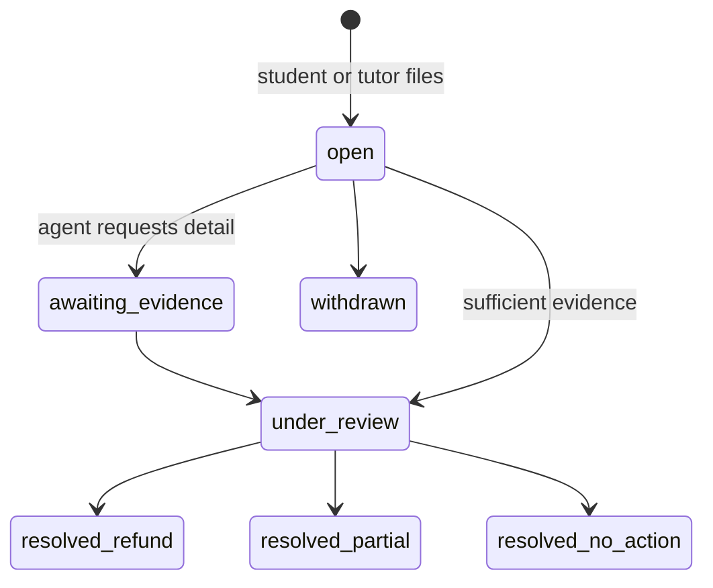

# 12 — Admin Console

*Implements capability 8: approve tutors, monitor disputes, revenue dashboard.*

## 12.1 Principles

1. **The console is an operations tool, not a database browser.** Every screen exists to make one recurring decision faster and more consistently. If nobody makes that decision weekly, the screen should not exist.
2. **Every write is audited.** Actor, action, before/after, IP, and a mandatory free-text reason. No exceptions, including for engineers.
3. **Least privilege.** A support agent resolving a dispute does not need the ability to issue a payout.
4. **Separate origin, separate hardening.** `admin.hellostudents.com.bd`, IP-allowlisted, mandatory MFA, 30-minute idle timeout, short-lived sessions.
5. **PII is minimised even here.** NID numbers show as `••••1234`. Full document images are viewable only by the verification role and every view is logged.

## 12.2 Tutor approval

The highest-throughput queue and the biggest lever on supply growth. **SLA 24 business hours; target median under 6.** Every hour of delay loses tutors back to the coaching centre they were about to leave.

The reviewer screen is a single decision surface — no tab-hopping:

```
┌────────────────────────────────────────────────────────────────────┐
│  Rifat Hossain · +8801712••••78 · submitted 4h ago      [SLA 20h] │
├──────────────────────────┬─────────────────────────────────────────┤
│  IDENTITY                │  PROFILE AS STUDENTS SEE IT             │
│  [NID front] [NID back]  │  ┌───────────────────────────────────┐  │
│  [Selfie]                │  │ Rifat Hossain                     │  │
│  Face match     92% ✅   │  │ HSC Physics · 8 yrs · 200+ to A+  │  │
│  NID readable      ✅    │  │ HSC Physics 1st  ৳900/hr          │  │
│  Duplicate NID     ✅    │  │ HSC Physics 2nd  ৳900/hr          │  │
│  Name matches      ✅    │  │ Online + Dhanmondi, Mohammadpur   │  │
│                          │  │ Sun–Thu 16:00–21:00               │  │
│  AUTO-CHECKS             │  └───────────────────────────────────┘  │
│  Bio length        ✅    │  [▶ intro video 0:47]                   │
│  No contact info   ✅    │                                         │
│  Rate plausible    ⚠️    │  CREDENTIALS                            │
│    ৳900 vs P75 ৳850     │  BSc EEE, BUET, 2019  [view] [verify]   │
│  Photo valid       ✅    │                                         │
│  Device/payout dup ✅    │  Requested tier: L2                     │
├──────────────────────────┴─────────────────────────────────────────┤
│  [Approve L1] [Approve L2] [Request changes ▾] [Reject ▾]  Reason: │
└────────────────────────────────────────────────────────────────────┘
```

**"Request changes"** is the most important control and is used far more than "Reject". It returns the profile to `draft` with a specific reason code that generates a Bangla SMS telling the tutor exactly what to fix. Rejecting a fixable profile loses a tutor permanently; asking them to retake a blurry NID photo does not.

Queue features: filter by SLA risk / tier requested / auto-check failures, sort oldest-first by default, bulk-approve for clean profiles passing every auto-check with high face-match confidence (still individually audited), and a fast keyboard path — a reviewer should clear a clean profile in under 40 seconds.

**Quality controls on the reviewers themselves:** a random 5% of decisions are double-reviewed, per-reviewer approval rates are tracked for drift, and every rejection is appealable to a second reviewer.

## 12.3 Taxonomy requests

Tutors request subjects that do not exist yet. An admin either maps the request to an existing subject (with a new alias — the common case, and the one that quietly improves search) or creates a new subject with full metadata. Requests are grouped by normalised text so twenty tutors asking for "ICT" are one decision, not twenty.

## 12.4 Revenue dashboard

Answers, on one screen: *is the marketplace growing, is it healthy, and are we making money?*

```
┌─ THIS MONTH (Aug 2026) ───────────── vs last month ─────────────┐
│  GMV                    ৳ 42,18,000        ▲ 23%                │
│  Net revenue            ৳  6,32,700        ▲ 21%                │
│  Effective take rate         15.0%         ▬                    │
│  Sessions completed          4,687         ▲ 19%                │
│  Refunds               ৳  1,08,400 (2.6%)  ▼ 0.4pp              │
│  PSP cost              ৳    71,200         ─                    │
│  Contribution margin   ৳  4,53,100 (10.7% of GMV)               │
├─────────────────────────────────────────────────────────────────┤
│  CREDIT LIABILITY (deferred revenue — NOT revenue)              │
│  Wallet balances        ৳ 18,44,000                             │
│  Unused hour packs      ৳  7,12,500                             │
│  Total obligation       ৳ 25,56,500   ← must be cash-backed     │
├─────────────────────────────────────────────────────────────────┤
│  LIQUIDITY                                                      │
│  Active tutors (≥1 session/30d)     1,284    ▲ 11%              │
│  Tutor activation (30d cohort)        63%    ▲ 4pp              │
│  Search → booking conversion         8.4%    ▲ 0.6pp            │
│  Repeat rate (same tutor, 30d)      56.2%    ▼ 1.1pp   ⚠️       │
│  Median time to first booking        71h     ▼ 9h               │
│  Zero-result search rate             11.2%   ▲ 1.8pp   ⚠️       │
└─────────────────────────────────────────────────────────────────┘
```

Two design choices worth stating explicitly:

**Credit liability is displayed as prominently as revenue.** It is a cash obligation to users, not income, and a team that loses sight of that will misread its own health badly. See [09 §9.8](09-payments-credits.md#98-accounting-treatment).

**Liquidity metrics sit alongside financial ones, on the same screen.** GMV rising while repeat rate falls is a business acquiring customers faster than it is keeping them, and that is invisible if the two numbers live on different pages.

Breakdowns available on every metric: by city/area, subject, grade, tutor tier, delivery mode, acquisition cohort. Every view exports to CSV; a scheduled daily email digest goes to founders and finance.

## 12.5 Demand gaps

Generated from search analytics ([08 §8.10](08-discovery-search.md#810-analytics)) — the supply team's work queue:

```
UNMET DEMAND — last 30 days
┌──────────────────────────────────────────────────────────────┐
│ Subject          Grade    Area          Searches  Supply  Gap│
│ Chemistry        Class 9  Bashundhara       412       2   🔴 │
│ ICT              HSC      Mirpur            287       4   🔴 │
│ English (EM)     O Level  Uttara            201       6   🟠 │
│ Mathematics      Class 8  Rampura           178       9   🟡 │
└──────────────────────────────────────────────────────────────┘
[Export recruiting list] [Notify waitlisted students when filled]
```

**Every failed search is market research.** This screen is how the growth team knows which neighbourhood to recruit in next, and it closes the loop by notifying the students who waitlisted once supply arrives.

## 12.6 Dispute management



| Category | SLA | Default resolution |
|---|---|---|
| Tutor no-show | 4 h | Auto-refund 100%; usually resolved before a human sees it |
| Technical failure | 12 h | Full refund if platform-attributable; evidence from join logs |
| Quality complaint | 48 h | Case by case; recording reviewed where one exists |
| Billing | 24 h | Ledger trace, corrected by compensating entry |
| Conduct / safeguarding | **Immediate** | Escalated to a named person; precautionary suspension first, investigation after |

The case view assembles everything automatically: booking and ledger history, join timestamps for both parties, the recording if it exists, prior disputes for both users, and the messaging thread. **An agent should not have to query anything to decide.**

Resolution actions: full/partial refund, credit goodwill grant, tutor warning, tutor suspension, student restriction, no action. Every one requires a reason and is audited. Refunds above ৳50,000 need a second approver.

Conduct and safeguarding disputes bypass the queue entirely and page a specific person. Precautionary action — pausing in-person sessions — happens before the investigation concludes. Getting this order wrong is not recoverable.

## 12.7 Financial operations

| Screen | Purpose |
|---|---|
| **Reconciliation** | Nightly invariant results ([04 §4.12](04-data-model.md#412-invariants)). Green or a specific failing invariant with the affected rows. |
| **Payout batches** | Review before execution: tutor count, total, failures from the prior run. Execution requires dual approval. |
| **Failed payouts** | Retry, correct the destination, or contact the tutor |
| **Manual adjustments** | Credit/debit with mandatory reason; dual approval above ৳50,000; every adjustment on a permanent report |
| **PSP reconciliation** | Platform records vs the provider's settlement file, differences highlighted |
| **Tax export** | Per-tutor annual earnings for withholding and reporting |

The reconciliation screen is checked every morning. **A red state is treated as a production incident**, not a data-quality nuisance — a ledger that does not balance means either a bug that is losing money or a bug that is inventing it, and both are urgent.

## 12.8 User management

| Action | Effect | Role |
|---|---|---|
| View user | Profile, bookings, ledger, devices. PII masked; unmasking is logged. | support |
| Suspend student | Blocks booking; existing sessions honoured | support |
| Suspend tutor | Cancels all future sessions, refunds every student automatically, delists profile, holds earnings | trust_safety |
| Merge duplicates | Combines ledgers and history | admin |
| Delete account | GDPR-style erasure with financial-record retention ([14](14-security-compliance.md)) | admin |
| Impersonate | **Read-only**, time-boxed to 30 min, banner visible to the agent, fully logged, never for money screens | support lead |

Impersonation is read-only by design. The debugging convenience of write-impersonation is real and is not worth the audit ambiguity of an action that cannot be attributed to a person with certainty.

## 12.9 Roles

| Role | Capabilities |
|---|---|
| `support` | View users, resolve standard disputes, issue goodwill credits ≤ ৳500, read-only impersonation |
| `verification` | Tutor approval queue, credential verification, view identity documents |
| `trust_safety` | Suspensions, safeguarding cases, review moderation, fraud investigation |
| `finance` | Payouts, refunds, reconciliation, adjustments, exports |
| `admin` | Taxonomy, config, role grants, account merges |
| `superadmin` | Feature flags, kill switches, break-glass access |

Roles are additive and every grant is audited. `superadmin` is limited to two people, requires hardware MFA, and every session generates an alert to the other holder.

## 12.10 Operational alerts

Surfaced in-console and routed to on-call:

| Alert | Threshold |
|---|---|
| Approval queue SLA breach | Any profile > 20 h |
| Dispute SLA breach | Any case past its category SLA |
| Ledger reconciliation failure | Any — **pages immediately** |
| Payment success rate | < 90% over 15 min, per method |
| SMS delivery rate | < 95% over 30 min |
| Booking volume anomaly | > 3σ from the same hour last week |
| Refund rate spike | > 5% of daily GMV |
| Sessions missing a live link | Any starting within 10 min |
| New-tutor signup collapse | < 50% of the 7-day average |
| Credit liability vs cash | Any divergence |

---

Next: [13 — Notifications](13-notifications.md)
