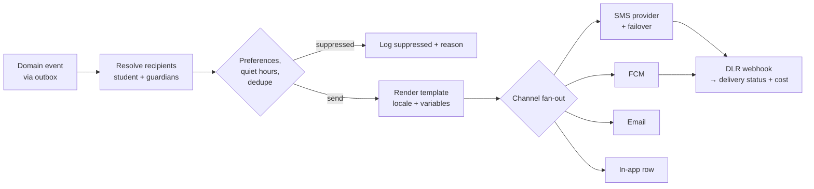

# 13 — Notifications

*Implements capability 9: SMS/email reminders — with SMS as the primary channel, as the market requires.*

## 13.1 Channel strategy

Email engagement in Bangladesh is low outside professional contexts. Many students have no email address they check; many parents have one only because a form demanded it. Designing an engagement system around email — the reflex in most Western SaaS — produces a system that silently does not work.

**Channel priority, and what each is actually for:**

| Channel | Reach | Cost | Use for |
|---|---|---|---|
| **SMS** | Universal — works on every phone, no app, no data, no internet | ~৳0.30–0.60 per message | Everything time-critical: OTP, booking confirmation, class reminders, no-show refunds, payout sent |
| **Push (FCM)** | App users only | Free | Rich, non-critical, immediate: new messages, recording ready, promotional |
| **In-app** | Active sessions | Free | Full history, always the complete record |
| **Email** | Low engagement | ~free | Receipts, statements, long-form, legally-required records |
| **WhatsApp Business** *(Phase 3)* | Very high in BD | Per-conversation | Rich reminders with buttons; strong candidate to displace much SMS volume |

**The rule: anything the user must act on within an hour goes by SMS.** Everything else prefers push, falling back to SMS only where the outcome materially matters.

SMS is a real per-message cost against a ~15% commission on a ~৳700 session. Sending six SMS per booking meaningfully erodes contribution margin, so message count is budgeted, not incidental — see §13.7.

## 13.2 SMS

### Gateway

Use a BTRC-compliant local aggregator with a **masked sender ID** (`HELLOSTUDENT` rather than a shortcode). Masked messages have visibly better trust and open behaviour than numeric senders, which read as spam.

Requirements for the provider:

- Masked sender ID registration (needs trade licence and BTRC-side approval — **start this early, it is a multi-week lead time and it will block launch if left late**)
- Delivery receipts (DLR) via webhook
- Unicode/UCS-2 support for Bangla
- Sub-10-second delivery for OTP
- Coverage across GP, Robi, Banglalink, Teletalk, Airtel
- A sandbox

**Two providers, always.** SMS delivery in this market degrades without warning, and OTP is the login path — a single-provider outage is a total login outage. The `SmsProvider` interface supports automatic failover on delivery-rate degradation, with the secondary provider kept warm by a small share of live traffic so its failover path is known to work.

### The Bangla character problem

This has direct cost consequences and is routinely overlooked:

| Encoding | Chars per SMS | Concatenated |
|---|---|---|
| GSM-7 (Latin) | 160 | 153 |
| **UCS-2 (Bangla)** | **70** | **67** |

A Bangla message is billed at roughly **half the character budget**. A 200-character Bangla reminder is 3 SMS segments and costs 3×.

Consequences, applied as hard rules:

- Bangla templates are budgeted to **≤ 67 characters** wherever possible — one segment.
- Templates are unit-tested for segment count; **exceeding the budget fails CI.**
- Interpolated values are length-capped (names truncated, times abbreviated) so a long name cannot silently push a message into a second segment.
- URLs are shortened via a first-party shortener (`hs.bd/x/AbC12`) — also giving click attribution.
- Emoji force UCS-2 even in an otherwise-Latin message and are therefore banned in SMS templates.

### Template examples

```
OTP (bn, 1 segment):
  HelloStudents কোড: 483920। ৫ মিনিটে মেয়াদ শেষ। কাউকে দেবেন না।

Booking confirmed (bn, 1 segment):
  ক্লাস বুক হয়েছে! রিফাত স্যার, ১৪ আগস্ট বিকাল ৪টা। বিস্তারিত: hs.bd/b/9fK2

Reminder T-1h (bn, 1 segment):
  আপনার ক্লাস ১ ঘণ্টা পরে — রিফাত স্যার, বিকাল ৪টা। লিংক: hs.bd/j/9fK2

Tutor no-show refund (bn, 1 segment):
  দুঃখিত, শিক্ষক আসেননি। ৳৯০০ ফেরত দেওয়া হয়েছে। ব্যালেন্স ৳২,৪০০।

Payout sent (bn, 1 segment):
  ৳১৮,৪৪৫ আপনার bKash ••••৭৮ নম্বরে পাঠানো হয়েছে। TrxID: 8FK2M9QA
```

Every template exists in `bn-BD` and `en`; selection follows the user's `locale`.

## 13.3 The notification catalogue

### Student / guardian

| Event | SMS | Push | Email | Notes |
|---|---|---|---|---|
| OTP | ✅ | — | — | Never any other channel |
| Booking confirmed | ✅ | ✅ | ✅ | Guardian also notified when linked |
| Reminder T−24 h | ✅ | ✅ | — | Suppressed if booked < 24 h ahead |
| Reminder T−1 h | ✅ | ✅ | — | |
| Reminder T−10 min + join link | ✅ | ✅ | — | **Ignores quiet hours** — time-critical |
| Session rescheduled | ✅ | ✅ | ✅ | With one-tap accept / refund |
| Session cancelled by tutor | ✅ | ✅ | ✅ | Includes the automatic refund confirmation |
| Tutor no-show refund | ✅ | ✅ | ✅ | Sent *before* the student asks |
| Recording ready | — | ✅ | — | SMS only if the student missed the live session |
| Credits added | ✅ | ✅ | ✅ | Receipt by email |
| Low balance (< 1 session) | — | ✅ | — | Max once per 7 days |
| Hour pack expiring | ✅ | ✅ | — | At 30 and 7 days |
| Refund issued | ✅ | ✅ | ✅ | |
| Review request | — | ✅ | — | 2 h after session; once only |
| Dispute update | ✅ | ✅ | ✅ | |

### Tutor

| Event | SMS | Push | Email |
|---|---|---|---|
| Profile approved | ✅ | ✅ | ✅ |
| Profile needs changes | ✅ | ✅ | ✅ |
| New booking | ✅ | ✅ | — |
| Booking cancelled | ✅ | ✅ | — |
| Daily schedule digest (07:00) | — | ✅ | — |
| Reminder T−1 h | ✅ | ✅ | — |
| **T+5 min, not joined** | ✅ | ✅ | — |
| **T+15 min, not joined** | ✅ | ✅ | ✅ |
| New review | — | ✅ | — |
| Payout sent | ✅ | ✅ | ✅ |
| Payout failed | ✅ | ✅ | ✅ |
| Weekly earnings summary | — | ✅ | ✅ |
| Suspension / warning | ✅ | ✅ | ✅ |

The two tutor-absence messages are the highest-value notifications in the system: each one that lands prevents a no-show, a refund, a dispute and a lost student.

## 13.4 Delivery pipeline



- Triggered from the **outbox**, so a notification is never sent for a transaction that rolled back — and never lost because a queue was briefly down.
- **`dedupe_key` on every notification**, so a retried consumer cannot send the same reminder twice. Nothing destroys trust in a notification channel faster than duplicate SMS.
- Retries: 3 attempts with exponential backoff; after that, failover to the secondary provider; after that, mark failed and surface in-app.
- Per-delivery cost is recorded on the row, making notification spend queryable per feature, per tutor and per session.

## 13.5 Preferences

| Category | User control |
|---|---|
| **Transactional** (OTP, bookings, reminders, money) | Cannot be disabled — but channel is adjustable where safe |
| **Recommendations** | Opt-out |
| **Marketing / promotions** | **Opt-in only.** Default off. |
| **Digests** | Frequency selectable |

Marketing SMS is opt-in, defaults to off, and always carries opt-out instructions. Beyond being the right default, unsolicited commercial SMS is a regulated area in Bangladesh and a fast route to losing a masked sender ID — which would take out OTP delivery with it.

## 13.6 Quiet hours

Default **22:00–08:00 Asia/Dhaka**, user-adjustable.

| Class | Quiet-hours behaviour |
|---|---|
| Time-critical (OTP, class in ≤ 1 h, tutor absent) | **Sent** — the whole point of the message is timeliness |
| Transactional non-urgent (booking confirmed, payout sent) | Held until 08:00 |
| Digests and marketing | Held |

Additionally: no marketing SMS on Fridays before 14:00, and none during Eid prayer windows. These are cheap, respectful defaults, and they are the difference between a sender ID that people trust and one they block.

## 13.7 Cost control

At scale, notification spend is a real line on the P&L. Controls:

- **A per-booking SMS budget of 4 messages.** Everything else must go by push or in-app.
- Push-first for any app user, with SMS fallback only if the push is not acknowledged within 10 minutes — and only for messages where the outcome matters.
- Bundle where possible: a tutor with three sessions tomorrow gets one digest, not three reminders.
- Suppress the T−24 h reminder when the booking was made less than 24 hours ago.
- Cap OTP sends per number per day; a hard spend ceiling per number blocks SMS-pumping fraud.
- Track cost per booking as a dashboard metric; alert on a rise.
- Evaluate WhatsApp Business API in Phase 3 — per-conversation pricing beats per-segment SMS for multi-message flows, and WhatsApp penetration in Bangladesh is very high.

## 13.8 Reliability

| Concern | Handling |
|---|---|
| Provider outage | Automatic failover on delivery-rate degradation; secondary kept warm with live traffic |
| Silent delivery failure | DLR tracking with alerting below 95%; per-operator breakdown, since failures are usually operator-specific |
| Reminder job failure | Reminders are scheduled jobs with idempotency keys; a missed window is detected and either sent late or skipped deliberately, never silently dropped |
| Number recycled | Bounce-back handling; repeated failures flag the account for re-verification |
| Template error | Templates are versioned and validated in CI: variable coverage, segment count, both locales present |

**A synthetic canary sends a real SMS to a real test number on each operator every 15 minutes** and alerts on non-delivery. Silent SMS failure is otherwise almost invisible — nobody complains that they *didn't* get a message — and it takes down login, reminders and refund notices simultaneously.

## 13.9 Content principles

- **Bangla by default**, in natural language, not translated-English phrasing.
- **Lead with the actionable fact.** `আপনার ক্লাস ১ ঘণ্টা পরে` before any branding.
- **Include the amount and balance** in every money message. Ambiguity about money generates support contacts.
- **Never include a meeting link in SMS.** Link to the app, which authorises and then reveals ([07 §7.8](07-classes-scheduling.md#78-live-class-delivery)).
- **Never include an OTP in anything but the OTP message**, and always with a "do not share" warning — OTP social engineering is common in this market.
- Times in 12-hour format with বিকাল/সকাল/রাত, which is how people actually speak, not `16:00`.
- Every SMS is identifiably from HelloStudents within the first few words.

---

Next: [14 — Security, Privacy & Compliance](14-security-compliance.md)
