# 17 — Schema Diagram

Visual companion to [04 — Data Model](04-data-model.md), which holds the authoritative DDL. This page shows **shape and relationships**; where the two disagree, [04](04-data-model.md) wins.

The schema is drawn per module rather than as one 40-table diagram, because module ownership is a real constraint here: **a module may only reach another module's tables through its service interface, never by a SQL join** ([ADR-002](adr/ADR-002-modular-monolith.md)). Cross-module edges in these diagrams are therefore *logical* references, and are drawn separately in [§17.8](#178-cross-module-reference-map).

Legend: `PK` primary key · `FK` foreign key · `UK` unique · **bold entities** carry a database-enforced invariant.

---

## 17.1 Module ownership

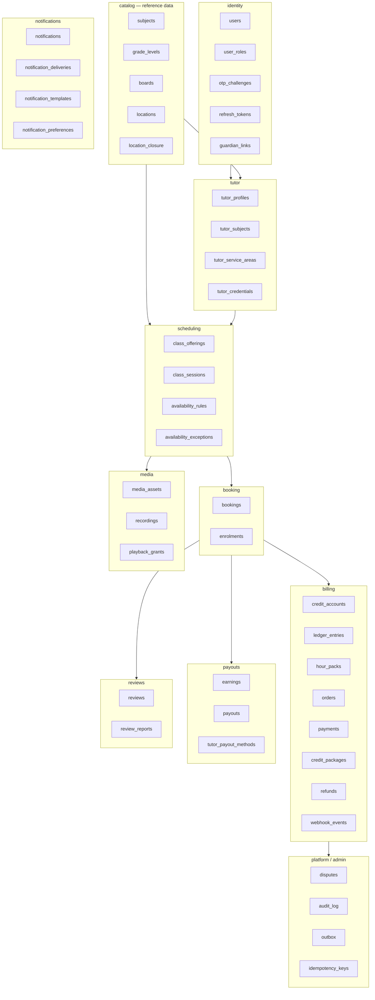

---

## 17.2 Identity & catalog

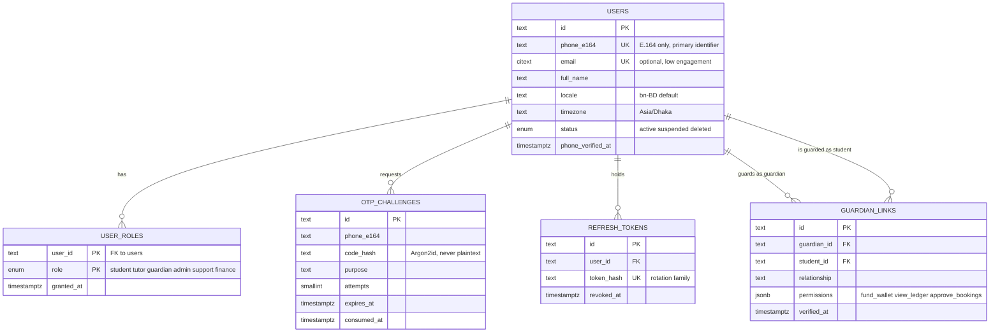

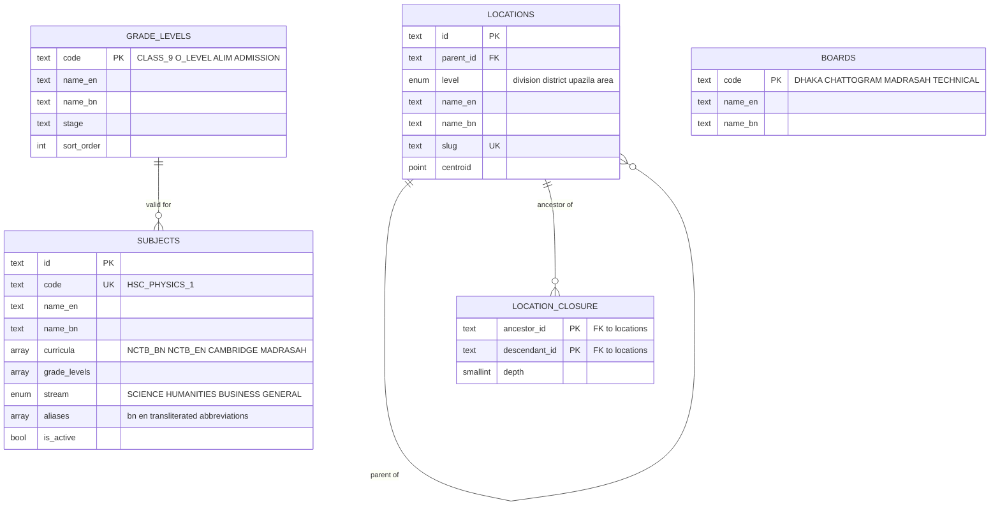

> **Why a closure table.** "All tutors in Dhaka division" must be one indexed lookup, not a recursive CTE on every search request. The closure table is what makes the area filter in [08](08-discovery-search.md#83-filters) cheap at any level of the hierarchy.

---

## 17.3 Tutor

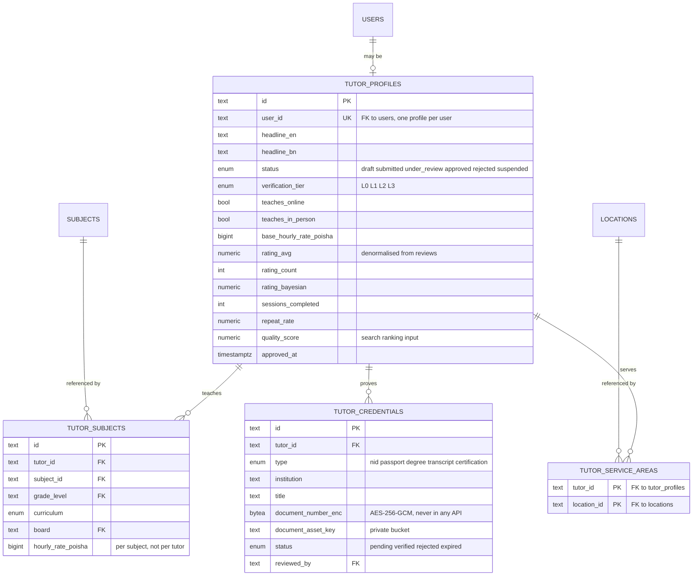

> **Rate lives on `tutor_subjects`, not `tutor_profiles`.** A tutor charges differently for HSC Physics than for Class 9 Maths, and search filters on price must hit the *subject* rate. `base_hourly_rate_poisha` is a display default only.

---

## 17.4 Scheduling & booking — the calendar spine

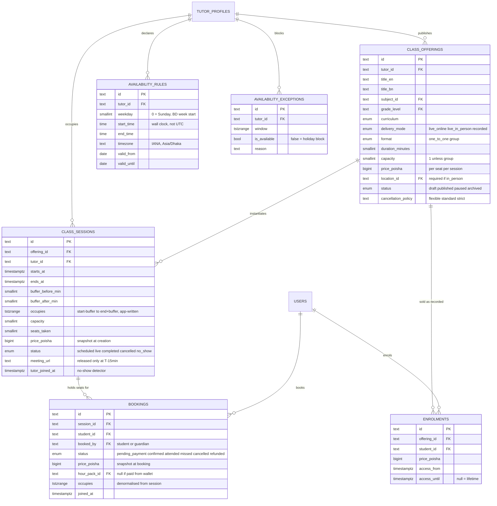

### The two exclusion constraints

These are the only reason `occupies` exists as a stored column on both tables, and they are the schema's most important feature ([ADR-004](adr/ADR-004-booking-concurrency.md)).

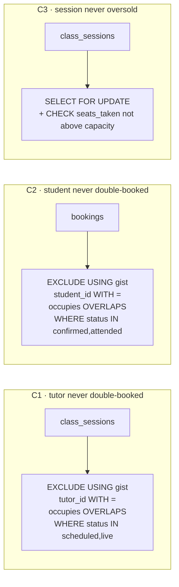

`occupies` is written by the application, never by a generated column: `timestamptz ± interval` is only `STABLE`, and a GiST exclusion constraint requires `IMMUTABLE` inputs. It is denormalised onto `bookings` because an exclusion constraint cannot reach through a foreign key to the session's range.

---

## 17.5 Billing — the money spine

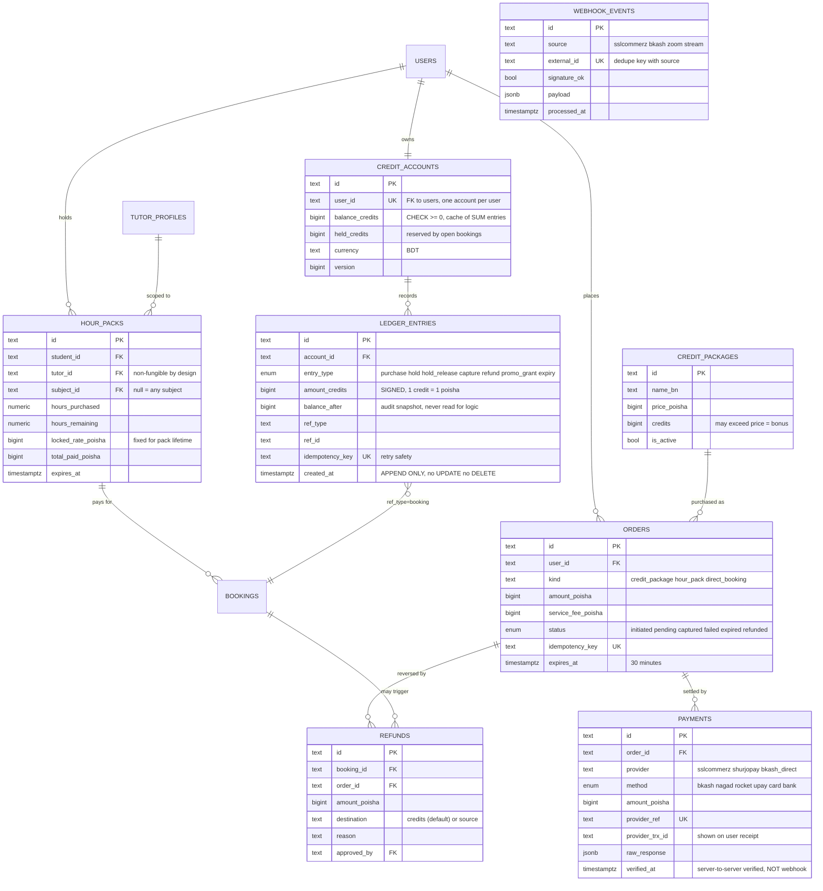

> **`verified_at` is the load-bearing column.** Credits are never issued from webhook data — only after an independent `verifyPayment` call confirms status and amount ([09 §9.5](09-payments-credits.md#95-payment-integration)). `WEBHOOK_EVENTS` has no foreign key to `PAYMENTS` on purpose: an unrecognised or replayed webhook must still be persisted and deduped before anything tries to match it.

### Money state machine

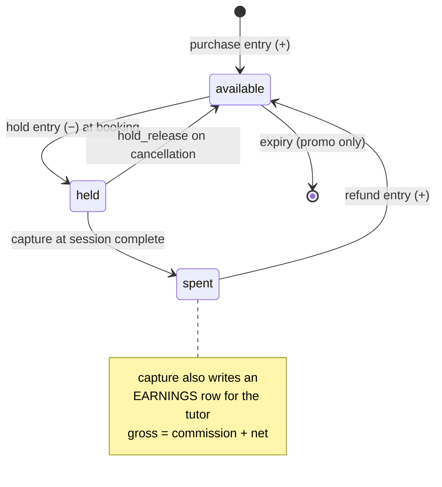

---

## 17.6 Payouts

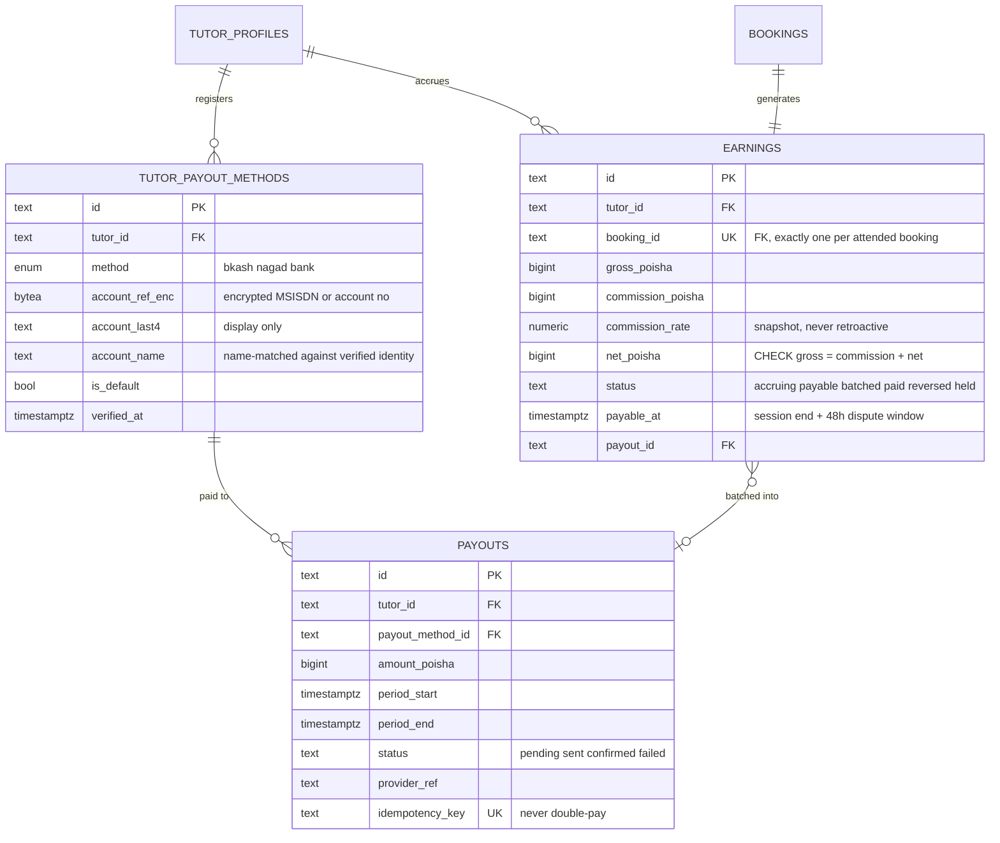

> **`CHECK (gross_poisha = commission_poisha + net_poisha)`** turns a rounding bug into a write-time failure instead of a few poisha of drift per session that compounds into an unexplainable variance months later.

---

## 17.7 Media, reviews, notifications, platform

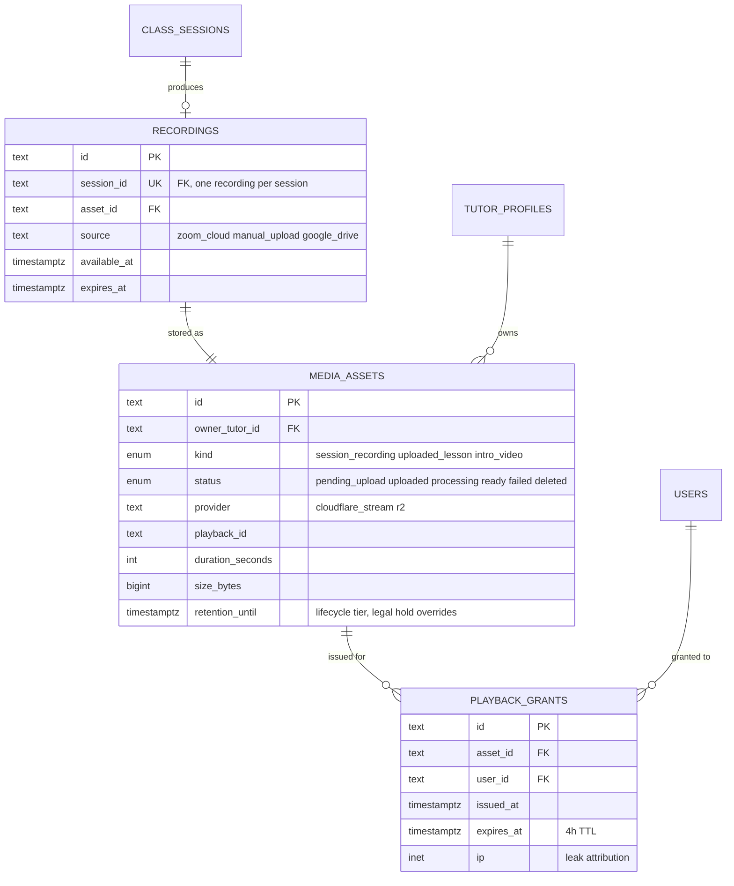

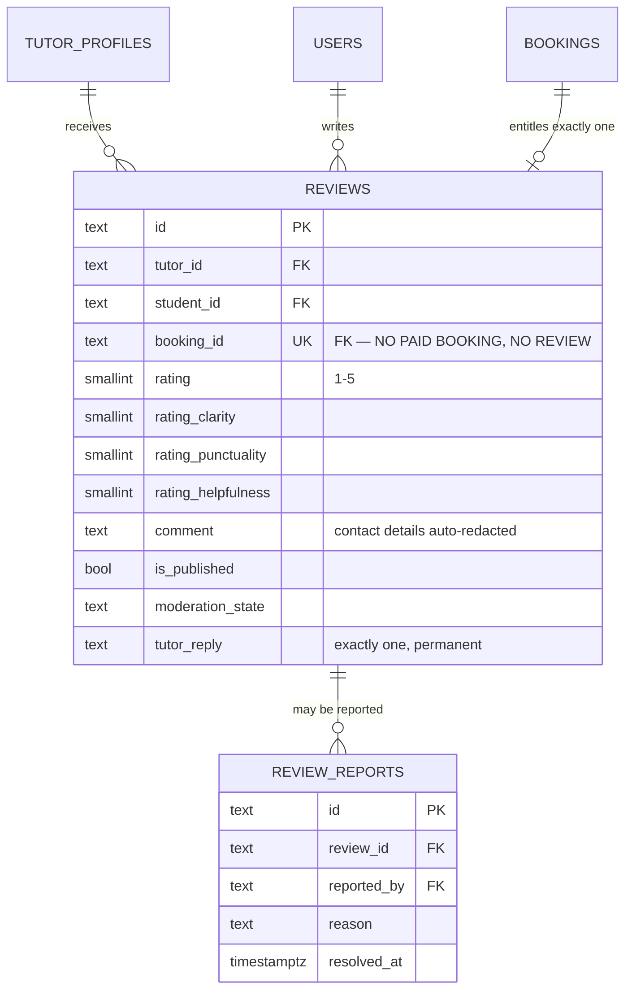

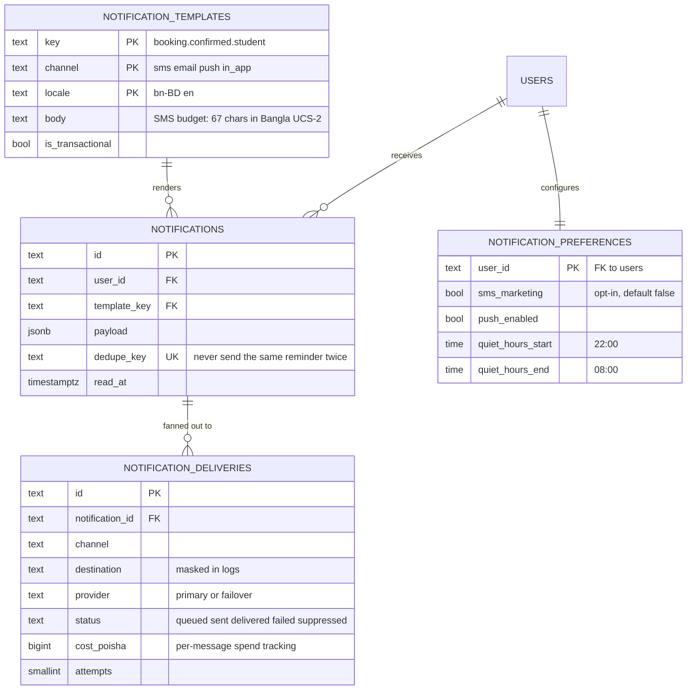

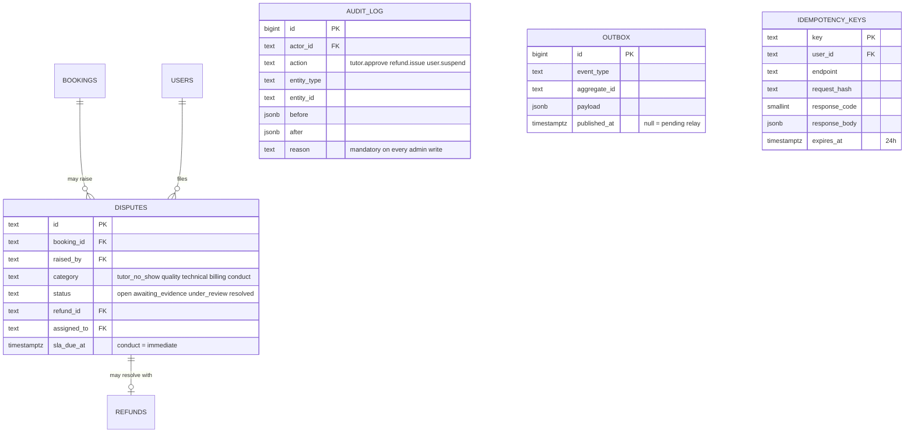

---

## 17.8 Cross-module reference map

Logical references that cross a module boundary. In code these are resolved through the owning module's service interface or a maintained read model — **never a SQL join** ([ADR-002](adr/ADR-002-modular-monolith.md)).

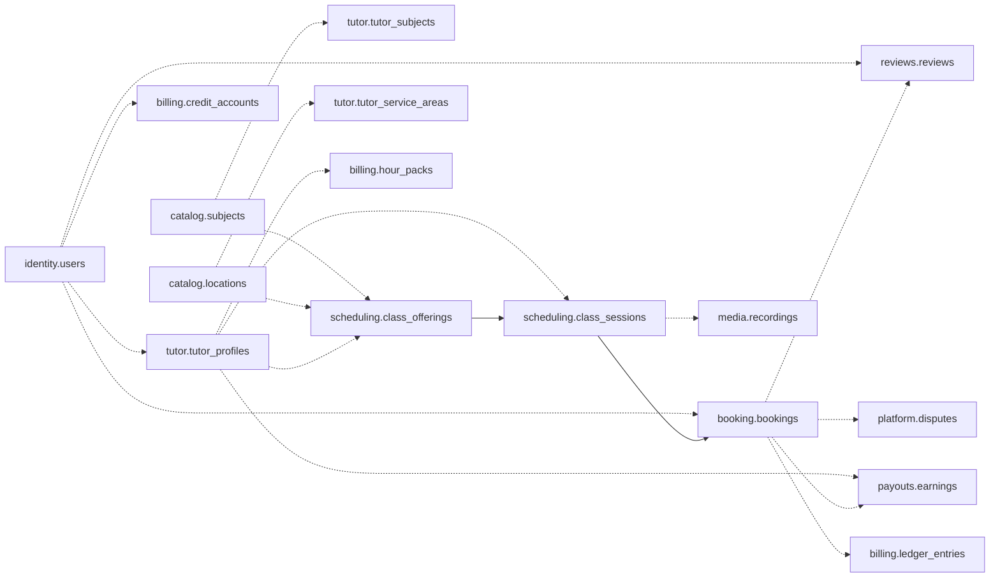

The two edges drawn solid — `class_offerings → class_sessions` and `class_sessions → bookings` — are the ones that stay inside a single transaction. Everything dotted crosses a module seam and is eventually consistent via the [outbox](03-architecture.md#34-module-boundaries).

---

## 17.9 Database-enforced invariants

What the schema guarantees without any application code cooperating. Full list in [04 §4.12](04-data-model.md#412-invariants).

| Constraint | Table | Guarantees |
|---|---|---|
| `EXCLUDE gist (tutor_id, occupies)` | `class_sessions` | A tutor is never in two sessions at once, under any concurrency |
| `EXCLUDE gist (student_id, occupies)` | `bookings` | A student is never in two classes at once |
| `CHECK (seats_taken <= capacity)` | `class_sessions` | A group session is never oversold |
| `UNIQUE (session_id, student_id)` | `bookings` | One seat per student per session |
| `CHECK (balance_credits >= 0)` | `credit_accounts` | A wallet can never go negative |
| `UNIQUE (idempotency_key)` | `ledger_entries` | A retried payment never double-credits |
| `UNIQUE (idempotency_key)` | `payouts` | A retried batch never double-pays |
| `CHECK (gross = commission + net)` | `earnings` | Commission arithmetic can never silently drift |
| `UNIQUE (booking_id)` | `reviews` | No paid, attended booking → no review |
| `UNIQUE (booking_id)` | `earnings` | Exactly one earnings row per booking |
| `UNIQUE (provider, provider_ref)` | `payments` | One payment per provider reference |
| `UNIQUE (source, external_id)` | `webhook_events` | A replayed webhook is processed once |
| `UNIQUE (session_id)` | `recordings` | One recording per session |
| `UNIQUE (phone_e164)` | `users` | One human, one account |

Every one of these is a rule that would otherwise live in application code, be forgotten by some future call path — an admin tool, a bulk import, a migration script — and fail only under production concurrency. Putting them in the schema is what makes them survive the codebase.

---

Back to the [documentation index](../README.md) · [04 — Data Model](04-data-model.md) holds the DDL.
